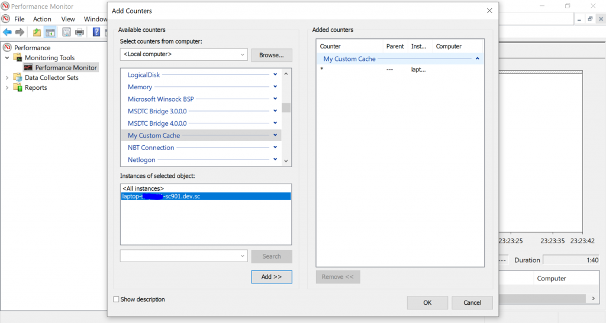
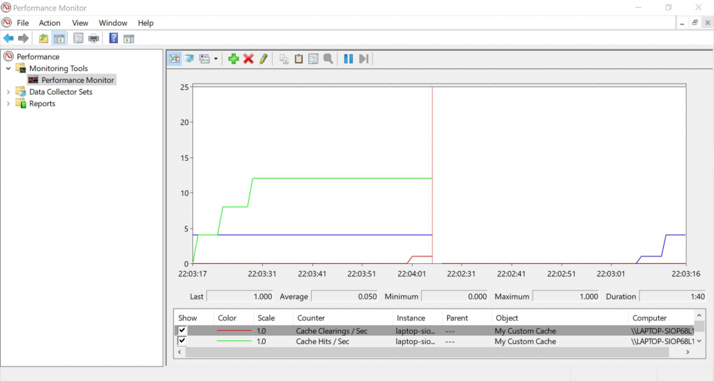
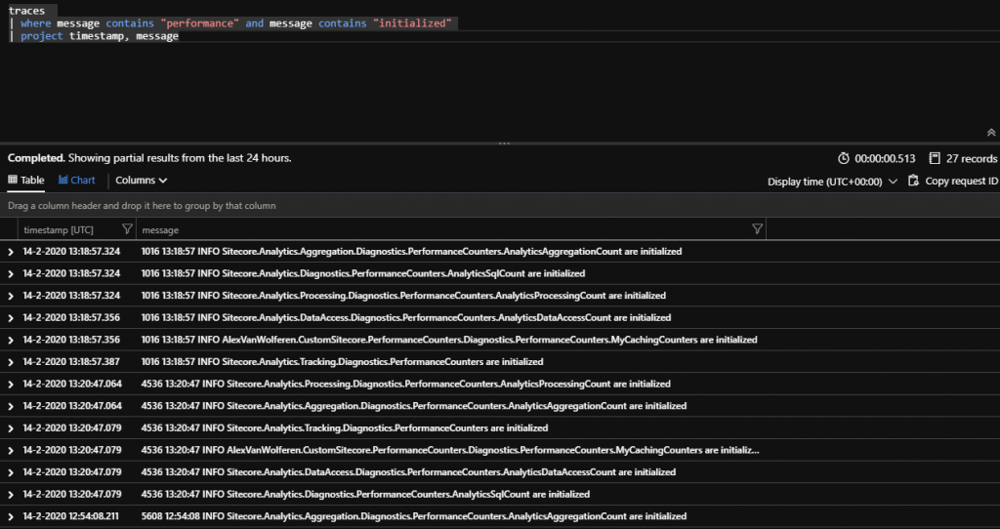
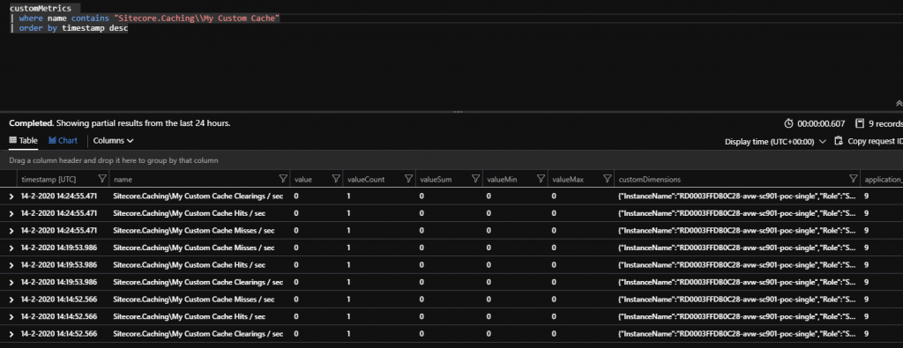
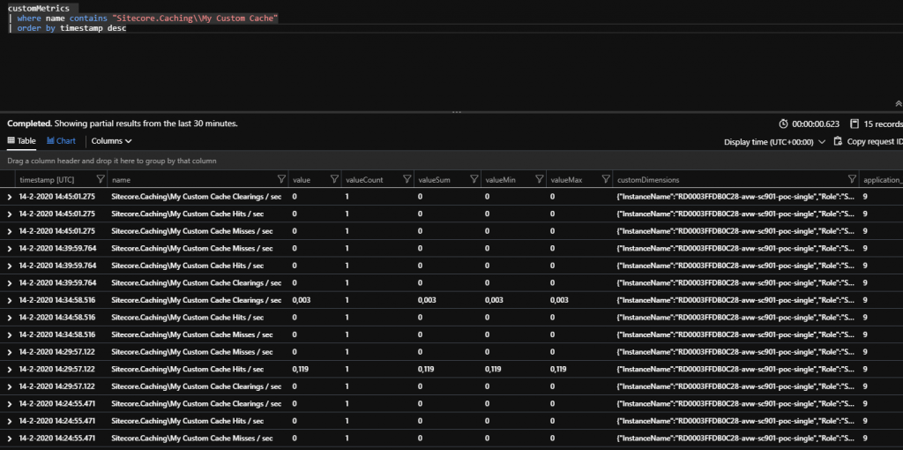
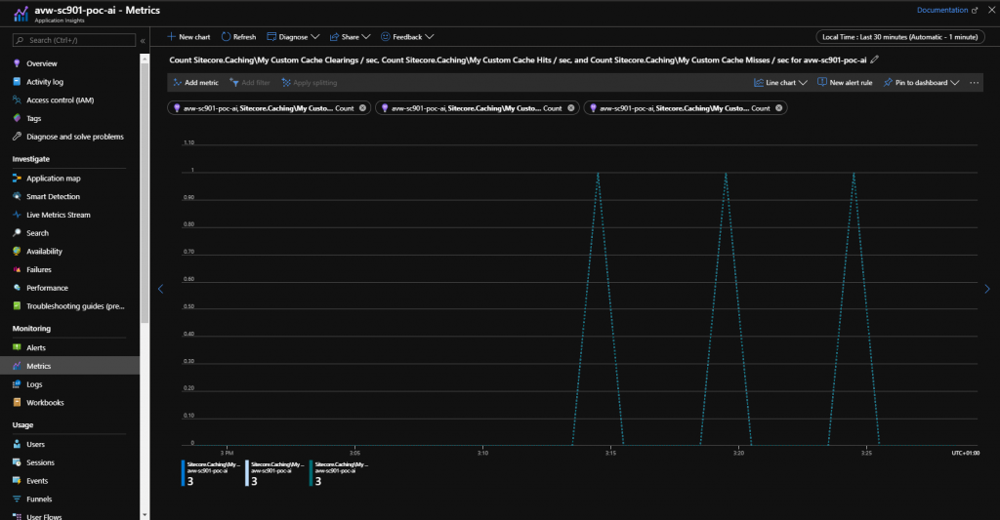
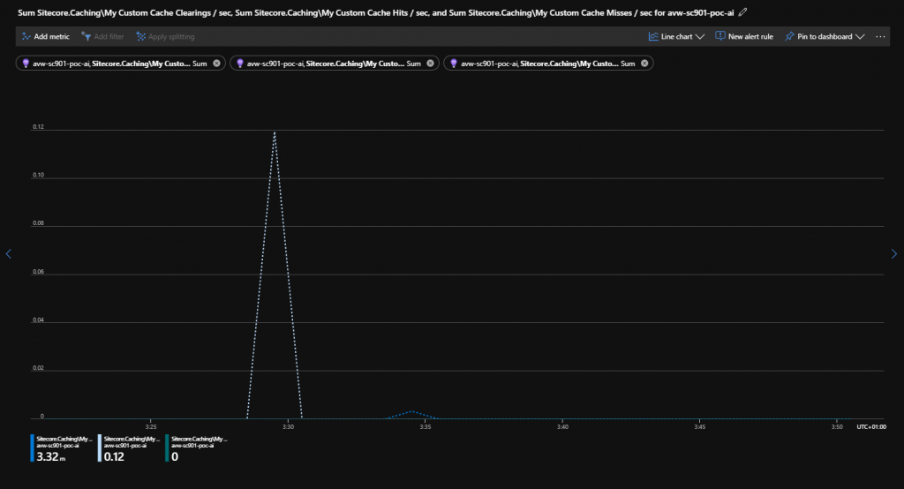

Everybody likes performance counters, don't you? They give a lot more information on what actually happens on your platform. Do you like using custom caches in your Sitecore solution? Do you actually know how often they are used? Do you know how many cache hits, misses and clearings you hit on those? There is an easy way to get more insights on these precious pieces of information. And that does not include your daily dose of Sitecore logs and traces.

## Back in the good old days of Sitecore 6.2

Sitecore comes out of the box with a large amount of performance counters. Back in the old days of Sitecore 6.2 there was a nice tool called [SitecoreCounters.exe](https://doc.sitecore.com/SdnArchive/upload/sdn5/faq/administration/sitecorecounters.zip) and you can still find it on SDN Archive [https://doc.sitecore.com/SdnArchive/Products/Sitecore%20V5/Sitecore%20CMS%206/Update/6\_2\_0\_rev\_100104.html](https://doc.sitecore.com/SdnArchive/Products/Sitecore%20V5/Sitecore%20CMS%206/Update/6_2_0_rev_100104.html) check section 1.5. That particular tool actually created all the necessary performance counters based on a XML file that tagged along in the ZIP archive. This tool is still useful for your local development environment or on-premise installations of Sitecore.

This short write-up guides you how to implement your own counters, how to use them and what you should take note off when you want them to be usable when running Sitecore on-premise or on Azure in Application Insights.

For your counters you need a few things:

## Setting the scene

In this example I have a simple Sitecore solution where I have a custom cache. I want to know how many times my cache received hits, misses and clearings. Three things that you probably might find useful when working with a custom cache. The cache itself is nothing more than a simple Sitecore Cache.

## The pieces and the glue

- Enable the performance counters!
- (MyCachingCounters.cs) A static class that keeps hold of
    - Category and name of your counters
    - Routine for initialization
- (InitializePerformanceCounters.cs) Processor in the Initialization pipeline that initializes your counters.
- On-premise
    - (SitecoreCounters.exe) can still be found on [SDN](https://doc.sitecore.com/SdnArchive/upload/sdn5/faq/administration/sitecorecounters.zip)
    - (Counters.xml) file with your counters
- Azure PaaS
    - (MyPerformanceCounters.Cloud.config) Configuration that tells the counterLoader to include your performance counters in the reports of Application Insights
- (CacheService.cs) a mechanism where you want to have counters added, for example a custom cache.

If you want to get your hands dirty on the code, stop reading and go to GitHub. [https://github.com/avwolferen/SitecorePerformanceCounters](https://github.com/avwolferen/SitecorePerformanceCounters)

## Enabling performance counters

To enable the performance counters change the Sitecore Setting.

```
      <setting name="Counters.Enabled" set:value="true" />
```

## Important notes!!

If you want to be able to have your performance counters work please do the following:

- Use the word "Sitecore" in your assembly name! Only performance counters located in an assembly containing that word will be reported in Application Insights.
- Use the exact suffix PerformanceCounters in your namespace where you have located your custom Counters. Sounds silly, but it does make a difference. Seeing them or not seeing them in your Performance Monitor. :)

## MyCachingCounters.cs

```
    public static class MyCachingCounters
    {
        public const string CategoryName = "Sitecore.Caching";
        private const string CacheClearingsName = "My Custom Cache Clearings / sec";
        private const string CacheHitsName = "My Custom Cache Hits / sec";
        private const string CacheMissesName = "My Custom Cache Misses / sec";

        /// <summary>
        /// Gets the counter that counts total number of times that an instance of the eventscache cache has been cleared.
        /// </summary>
        /// <value>
        /// The counter instance.
        /// </value>
        public static AmountPerSecondCounter CacheClearings
        {
            get;
            private set;
        }

        /// <summary>
        /// Gets the counter that counts total number of cache hits.
        /// </summary>
        /// <value>
        /// The counter instance.
        /// </value>
        public static AmountPerSecondCounter CacheHits
        {
            get;
            private set;
        }

        /// <summary>
        /// Gets the counter that counts total number of cache hits.
        /// </summary>
        /// <value>
        /// The counter instance.
        /// </value>
        public static AmountPerSecondCounter CacheMisses
        {
            get;
            private set;
        }

        /// <summary>
        /// Initializes analytics aggregation performance counters.
        /// </summary>
        public static void Initialize()
        {
            Type typeFromHandle = typeof(MyCachingCounters);
            Log.Info(typeFromHandle.FullName + " are initialized", typeFromHandle);
        }

        /// <summary>
        /// Initializes static members of the <see cref="T:Sitecore.Diagnostics.PerformanceCounters.CachingCount" /> class.
        /// </summary>
        static MyCachingCounters()
        {
            try
            {
                MyCachingCounters.CacheClearings = new AmountPerSecondCounter(CacheClearingsName, CategoryName);
                MyCachingCounters.CacheHits = new AmountPerSecondCounter(CacheHitsName, CategoryName);
                MyCachingCounters.CacheMisses = new AmountPerSecondCounter(CacheMissesName, CategoryName);
            }
            catch (Exception)
            {
            }
        }
    }
```

## InitializePerformanceCounters.cs

Easy peasy just a simple initalize processor. Make sure you add this one to your configs.

```
public class InitializePerformanceCounters
{
    public void Process(PipelineArgs args)
    {
        Assert.ArgumentNotNull(args, "args");
        MyCachingCounters.Initialize();
    }
}
```

## SitecoreCounters.exe and counters.xml

You can still download the SitecoreCounters.zip file from SDN, mentioned a few times earlier in this post ;)

The counters.xml matches the category and names of my counters.

```
<?xml version="1.0" encoding="utf-8" ?> 
<counters>
  <category name="Sitecore.Caching" description="Sitecore Custom Cache">
  <counter name="My Custom Cache Clearings / Sec" description="Cache Clearings / sec" />
  <counter name="My Custom Cache Hits / Sec" description="Cache Hits / sec" />
  <counter name="My Custom Cache Misses / Sec" description="Cache Misses / sec" />
  </category>
</counters>
```

## MyCounters.Cloud.config

This configuration should only be loaded when you are running at least with ApplicationInsights and the Cloud configs enabled. This configuration also matches the category and names of my counters. This will make your performance counters appear in your Application Insights magic on Azure.

```
<?xml version="1.0"?>
<configuration>
  <sitecore>
    <counterLoader type="Sitecore.Cloud.ApplicationInsights.CounterLoader,Sitecore.Cloud.ApplicationInsights">
      <includedCounters hint="raw:AddCounterToReport">
        <add category="Sitecore.Caching" name="My Custom Cache Clearings / sec" />
        <add category="Sitecore.Caching" name="My Custom Cache Hits / sec" />
        <add category="Sitecore.Caching" name="My Custom Cache Misses / sec" />
      </includedCounters>
    </counterLoader>
  </sitecore>
</configuration>
```

## Mechanism that ticks the counters

In this example I've created a really simple CacheService. The important pieces are the Increment calls on the actual PerformanceCounters.

```
    public class CacheService : Interfaces.ICacheService
    {
        static readonly Cache sitelockCache = new Cache("MyCustomCache.Cache", Sitecore.Configuration.Settings.GetSetting("MyCustomCache.CacheSize", "10MB"));

        public CacheService()
        {
            Sitecore.Events.Event.Subscribe("publish:end", ClearCache_OnPublishEnd);
            Sitecore.Events.Event.Subscribe("publish:end:remote", ClearCache_OnPublishEnd);
        }

        private void ClearCache_OnPublishEnd(object sender, System.EventArgs eventArgs)
        {
            sitelockCache.Clear();
            // Actual increment of a counter!
            MyCachingCounters.CacheClearings.Increment();
        }

        public TCachedObject GetOrAdd<TCachedObject>(string key, Func<TCachedObject> getFunky)
        {
            if (sitelockCache == null)
            {
                return default(TCachedObject);
            }

            var cachekey = $"{nameof(TCachedObject)}_{key}";
            TCachedObject value = default(TCachedObject);
            value = (TCachedObject)sitelockCache.GetValue(cachekey);

            if (value == null)
            {
                value = getFunky();
                sitelockCache.Add(cachekey, value);
                // Actual increment of a counter!
                MyCachingCounters.CacheMisses.Increment();
            }
            else
            {
                // Actual increment of a counter!
                MyCachingCounters.CacheHits.Increment();
            }

            return value;
        }
    }
```

## How does this look on your local machine?

By calling the SitecoreCounters.exe you will create the necessary counters.

```
PS C:\install\Sitecore\Counters> .\SitecoreCounters.exe   
Press enter to begin creating counters

Creating Sitecore counters
Preparing category: Sitecore.Caching
Preparing counter: My Custom Cache Clearings / Sec
Preparing counter: My Custom Cache Hits / Sec
Preparing counter: My Custom Cache Misses / Sec
Committing category: Sitecore.Caching
Done
```

After your counters have been created please restart Sitecore. The PerformanceCounter initialization takes place during the initialization of Sitecore. Take note of the initialization in your log files.

```
20924 21:59:14 INFO  Sitecore.Analytics.Aggregation.Diagnostics.PerformanceCounters.AnalyticsAggregationCount are initialized
20924 21:59:14 INFO  Sitecore.Analytics.Processing.Diagnostics.PerformanceCounters.AnalyticsProcessingCount are initialized
20924 21:59:14 INFO  Sitecore.Analytics.Diagnostics.PerformanceCounters.AnalyticsSqlCount are initialized
20924 21:59:14 INFO  Sitecore.Analytics.DataAccess.Diagnostics.PerformanceCounters.AnalyticsDataAccessCount are initialized
20924 21:59:14 INFO  AlexVanWolferen.SitecorePerformanceCounters.Diagnostics.PerformanceCounters.MyCachingCounters are initialized
20924 21:59:14 INFO  Sitecore.Analytics.Tracking.Diagnostics.PerformanceCounters are initialized
```

## Opening the Performance Monitor

The performance monitor on your local machine takes note of all the counters that you want to see. I only added the counters from the category "My Custom Cache". Make sure you add the counters from your Sitecore instance! Otherwise you will not see anything. They are only visible after Sitecore has been initialized.



Add the counters from your Sitecore instance

## Calling the CacheService

I've simply added a call to the service from an simple action in a controller. Just to get the misses and hits being triggered. :)

Call your page where you have added the rendering that calls the service and take a look at your graphs. Maybe hit the refresh button on your webbrowser and do a publish a few times from Sitecore.



Performance Monitor with the custom cache counters.

## And for Application Insights in Azure?

When we take a look at the PaaS solution on Azure it looks awesome as well. Maybe even more awesome!

When initializing this in Azure it looks pretty much the same. One important thing I had to change was the name of the category to Sitecore.Caching and update the names of the counters. In PaaS the AddCounterToReport shows some strange behaviour.



Traces during Sitecore initialization

When we take a look at the actual metrics on the Performance Counters they appear as follow.



CustomMetrics in Log Analytics





Custom Metrics in Metrics



## Wrap up

By using performance counters you really know if your cache is actually doing something. If you get tons of cache misses but you would expect cache hits then you probably need to do something with your cachekey. If you get a lot of cache hits then you are good. If you see too many cache clears happening then you might want to take a closer look into optimizing your cache clear construct. More on that in a different blog.

If you want to get your hands dirty on the code please go to GitHub.  
[https://github.com/avwolferen/SitecorePerformanceCounters](https://github.com/avwolferen/SitecorePerformanceCounters)

Please let me know if you find this useful!
