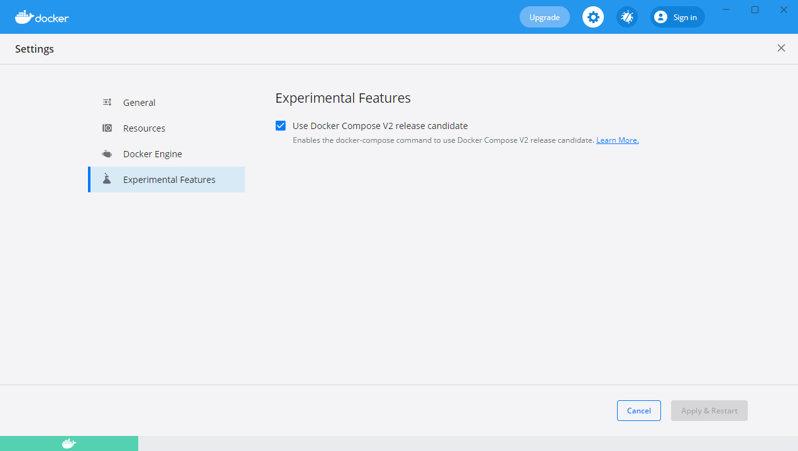
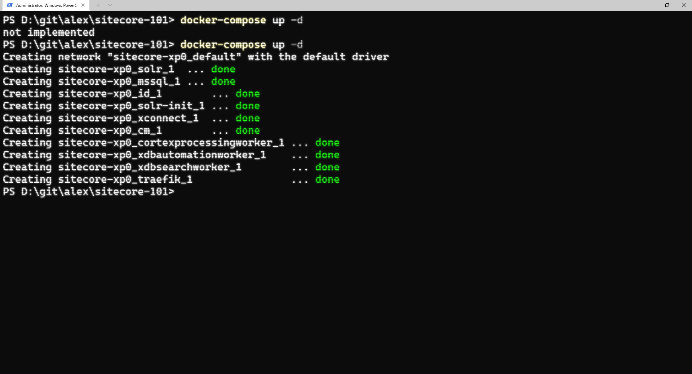

A couple of months ago I was struggling with getting my containers up and running again after a smooth period fiddling with containers. I started running into issues.

## Who to blame?

I simply didn't know when it all started, I was doing a lot of network related debugging and TCP capturing. I thought I could blame those drivers. Later, I found out what one of the main issues was I was dealing with. Keeping the tools updated and I should have paid more attention! Maybe I have a trigger finger for application updates.

## The absolute Last Resort - Reinstalling your machine

I thought I was out of options. After a couple of fights with my Windows installation I decided to start all over again. Reinstall the entire machine, after spending just 2 hours of Windows install and configuring the Docker prerequisites and installing Docker Desktop it started all over again. 

```
PS D:\git\alex\sitecore-101> docker-compose up -d
not implemented
PS D:\git\alex\sitecore-101>
```


## Get out all the tools!

I thought I messed it all up again, but how? I digged deep. I debugged the workings with Process Monitor, didn't found a clue what was going on. Memory dumps, not a single thing that made sense or pushed me into the right direction.

## Docker Desktop Settings?

I was easier than I could ever have imagined. During of after the installation of Docker Desktop I somehow managed to enable the *Docker Compose v2 release candidate* features. I should have never enabled those!

You can find this setting if you *right click* on the Docker tray icon and select *Settings* you will be prompted with the window where you can change those settingsn.



After disabling that checkbox, I hit "Apply & Restart" and went back to my PowerShell window and tried again. Instant success!



That's it for now. I hope I have helped a couple of people by disabling this silly checkbox.