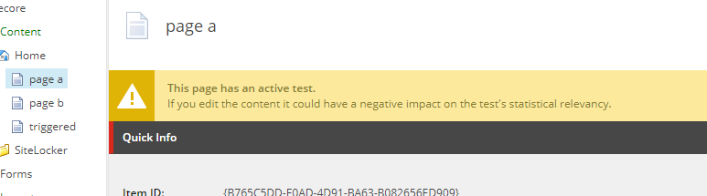
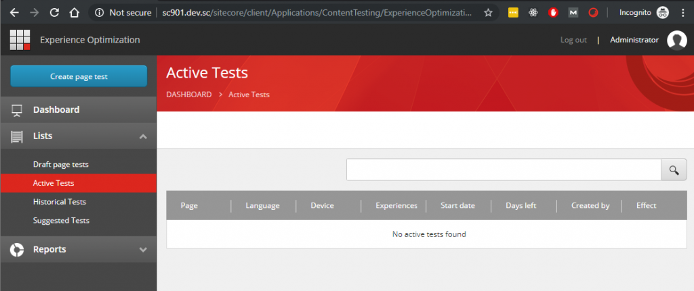
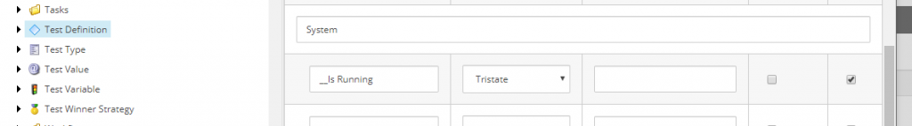
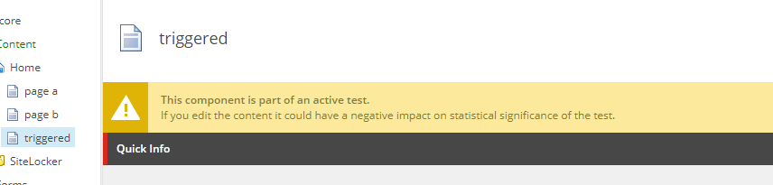
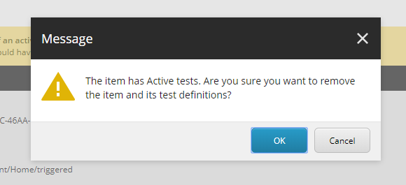
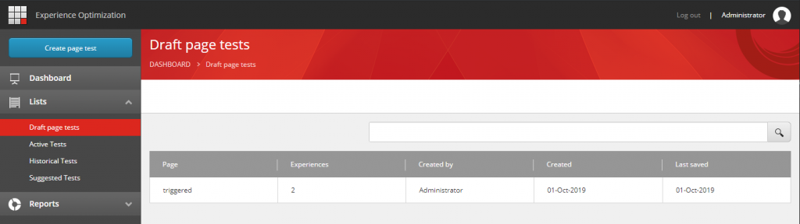
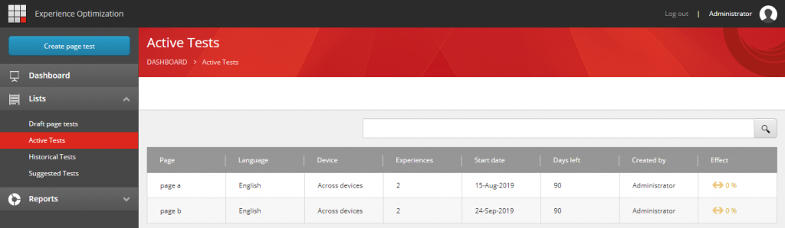
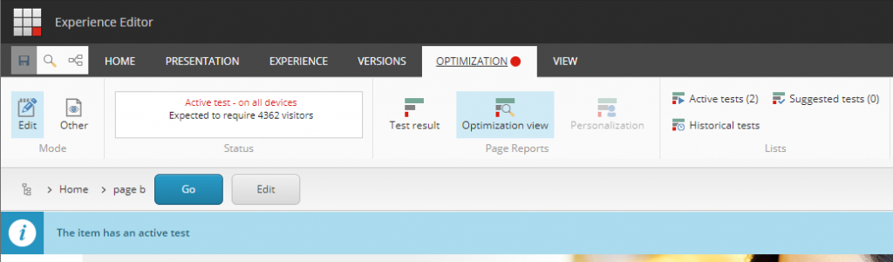
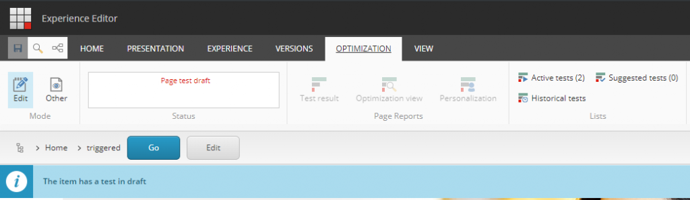

When you are working with Sitecore 9.0.1 (9.0.171219) in Azure with Azure Search you might be familiar with or experience the following symptoms.

- In your Content Editor you might have seen XHR requests about Optimization.ActiveTests.Count and Optimization.HistoricalTests.Count that have a value 0.
- Experience Optimization is not showing Active Tests, but you are 100% sure you just created one.
- Experience Optimization is not showing any Historical Tests and you are 100% sure you had them.
- Experience Optimization is showing Draft Tests but after starting they don't show up in the Active Tests and again you are 100% sure about these as well.
- Someone deleted a content item that was part of an active test.
- Someone deleted a content item that was subjected to a test.
- In your Traces you find weird entries telling you  
    AzureSearch Query \[sitecore\_testing\_index\]: &search=This\_Is\_Equal\_ConstNode\_Return\_Nothing


This all is basically caused by a TriState field that is handled like a boolean and that's simply wrong. The patch for fixing this can be found on my Github [https://github.com/avwolferen/SitecorePatchContentTesting](https://github.com/avwolferen/SitecorePatchContentTesting)  
Do not forget to rebuild the sitecore\_content\_testing index after applying this patch!

Things may happen! But they shouldn't! In the end you need to fix this. There are blogs that can be found telling you that this can be fixed by just renaming a field in the sitecore\_testing\_index.

```
<field fieldName="__is_running" cloudFieldName="is_running____" boost="1f" type="System.Boolean" settingType="Sitecore.ContentSearch.Azure.CloudSearchFieldConfiguration, Sitecore.ContentSearch.Azure" />
```

If it was that easy Sitecore would have already fixed that one in 9.0.1. And to be honest if this was the real deal then I really liked to see some evidence like screenshots that it's working. So, why not dive into this one myself.  
First let's get some evidence that it is not working!

- Weird queries in our logs..  
    AzureSearch Query \[sitecore\_testing\_index\]: &search=This\_Is\_Equal\_ConstNode\_Return\_Nothing
- "0 active tests" when we have actual tests.





- Historical tests is kind of odd because you cannot stop the test that you cannot see.
- Someone deleted a content item that was part of an active tests or someone deleted a content item that was subjected to a test. No one will ever know what happened to that test.

We need to fix this. First check is what is actually put into that \_\_is\_running field that is supposed to be a "Boolean" field.



Bingo! Tristate! Do you still remember what a Tristate means?

True or False or Idon'tReallyKnowJustLeaveItEmpty

In that last case the value would never end up in the sitecore\_testing\_index because it will simply fail. We need to fix that. Leaving the current field in tact and adding a new field that meets the requirements. For the sake of less complexity we choose to go with a System.String type. The new [configuration](https://github.com/avwolferen/SitecorePatchContentTesting/blob/master/App_Config/Include/z.Patching/Sitecore.ContentTesting.Testingsearch.config) adds just a few things, we do not modify the existing fields.

```
<field fieldName="__is_running_tristate" cloudFieldName="is_running_____s" boost="1f" type="System.String" settingType="Sitecore.ContentSearch.Azure.CloudSearchFieldConfiguration, Sitecore.ContentSearch.Azure" />
```

Because that field will not replace the original one we need to write a [custom implementation](https://github.com/avwolferen/SitecorePatchContentTesting/blob/master/ContentTesting/Models/TestingSearchResultItem.cs) that will use that field.

```
[IndexField("__is_running_tristate")]
public string IsRunningString
{
  get;
  set;
}
```

Because querying the original field is done in Sitecore.ContentTesting.ContentSearch.TestingSearch we need to replace that implementation and inherit from the original one. We also need implement our [ContentTestStore](https://github.com/avwolferen/SitecorePatchContentTesting/blob/master/ContentTesting/TestingSearch.cs) because we use our own model of course.

The next surprise was that the implementation for the ContentEditorWarnings that tell you if the item that you are currently working with if subject of a test isn't working well. The field that is used for this contains completely different contents. To resolve this I needed to introduce another [custom computedIndexfield](https://github.com/avwolferen/SitecorePatchContentTesting/blob/master/ContentTesting/ContentSearch/ComputedIndexFields/TestDataSources.cs) in our DocumentBuilder.

```
<field fieldName="datasourceitems_tidy">AlexVanWolferen.SitecorePatches.ContentTesting.ContentSearch.ComputedIndexFields.TestDataSources, AlexVanWolferen.SitecorePatches</field>
```

To resolve the issue with missing ContentEditorWarnings we need to implement our own [getContentEditorWarningspipeline](https://github.com/avwolferen/SitecorePatchContentTesting/blob/master/ContentTesting/Pipelines/GetContentEditorWarnings/GetContentTestingWarnings.cs).

To be able to delete test definition items the right way with confirmation dialogs we need to implement our own [uiDeleteItems](https://github.com/avwolferen/SitecorePatchContentTesting/blob/master/ContentTesting/Pipelines/DeleteItems/DeleteTestDefinitionItems.cs) that takes care of items that are involved in tests.

In the end we implemented just a few things. They are all tied easily together because we can configure the testingSearch and contentTestStore and the rest is just adding those fields and patching two processors in two pipelines.  
Do not forget to rebuild the sitecore\_content\_testing index after applying this patch!

Want proof that this works? Find out for yourself or just rely on these snippets.


Content Editor: The contentEditorWarning for an active test where this page is tested against.



Content Editor: The contentEditorWarning for an active test where this item is used as a datasource of a component.



Content Editor: The dialog that warns you what happens to the active test when you remove this item.  



Experience Optimization: Draft page tests.



Experience Optimization: Active tests and their details.



Experience Editor: Status of the active test on this page, and the real number of active tests.



Experience Editor: Status of the draft test on this page, and the real number of active tests.

I might be missing a single piece of this puzzle, please get in contact me if you are missing something.
