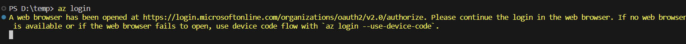
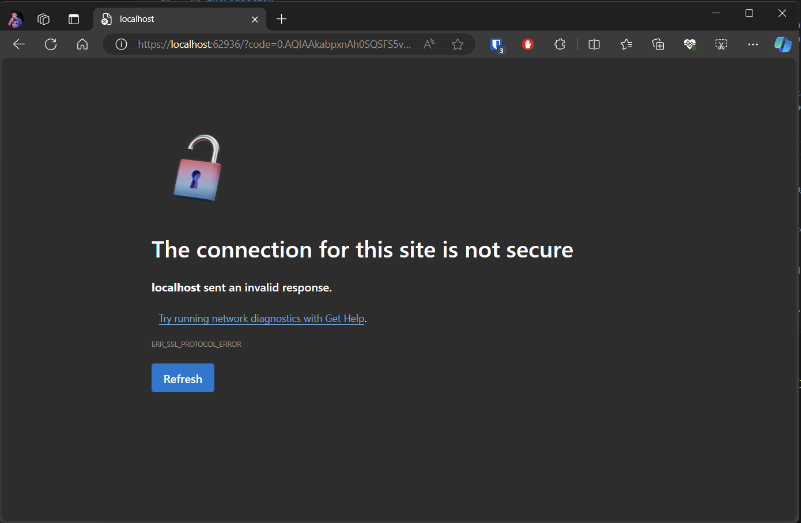
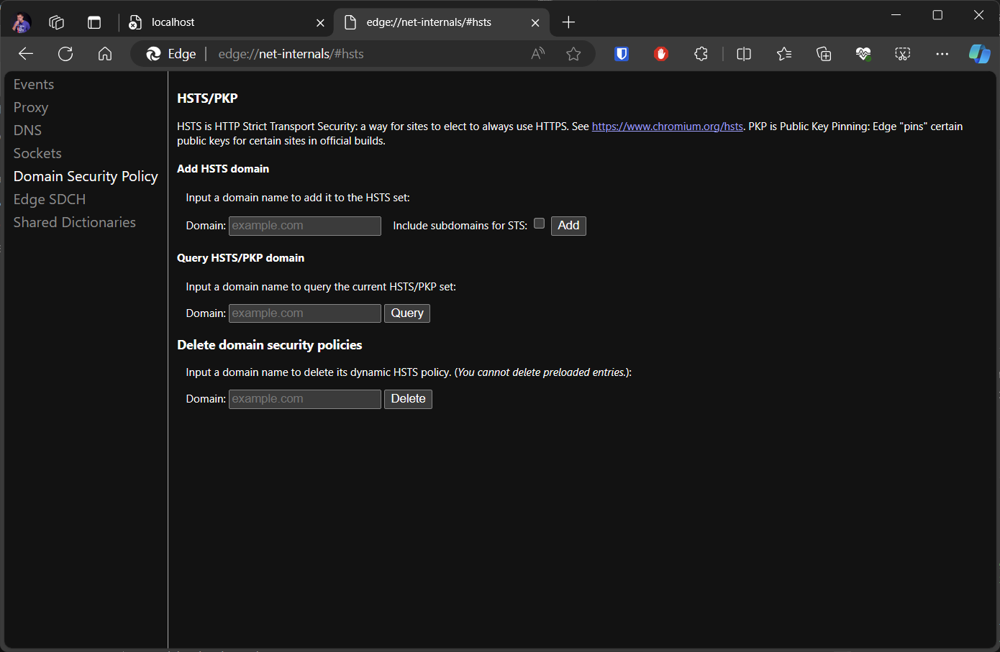
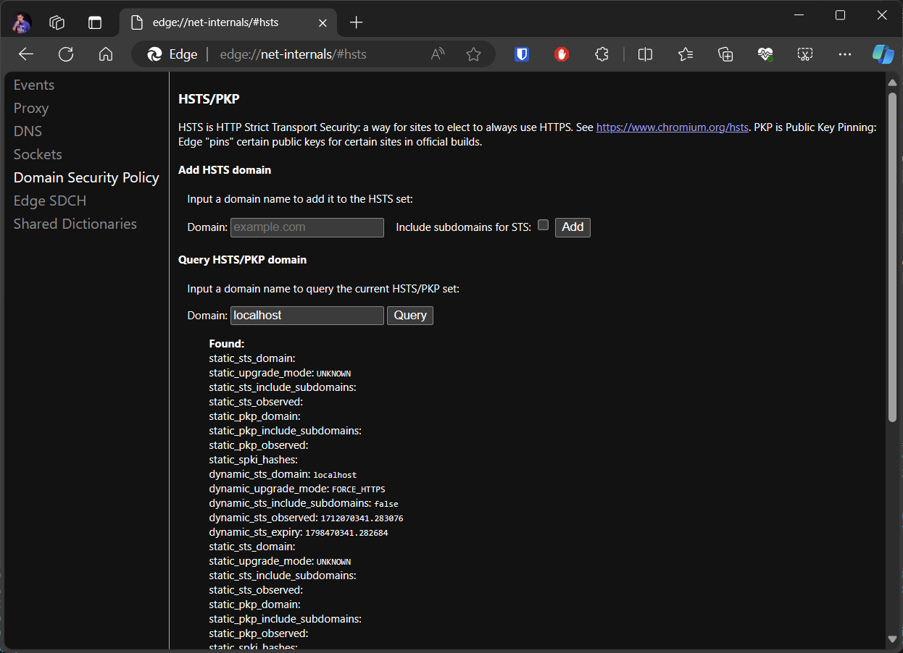
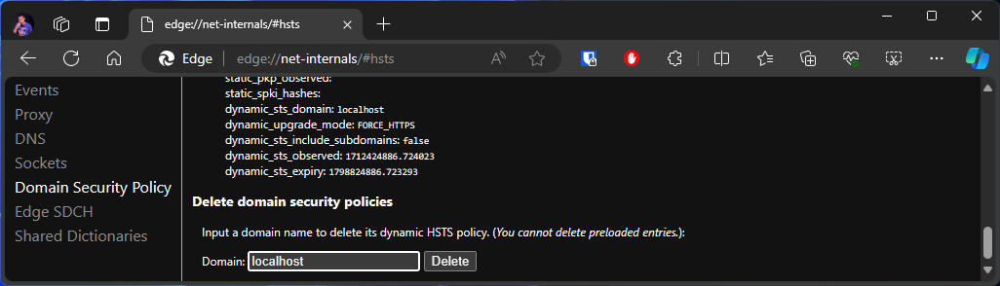
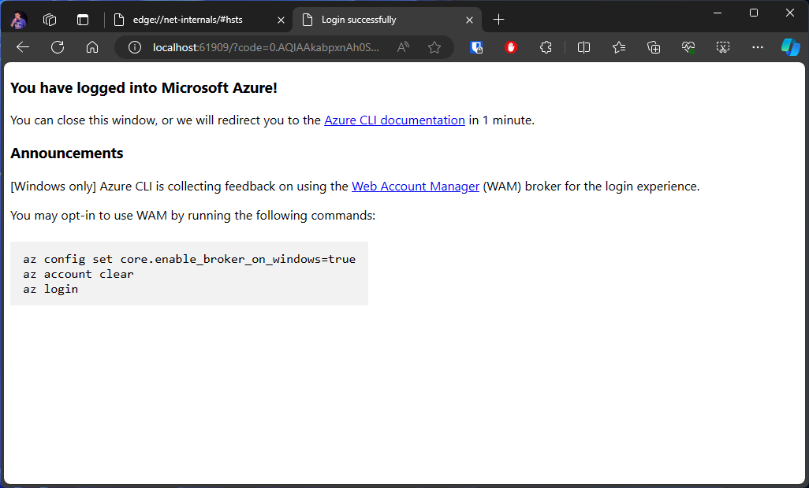

## Introduction

If you are experiencing issues with the Azure CLI command `az login` not working anymore, it could be due to an HSTS (HTTP Strict Transport Security) policy for localhost on your machine. This markdown provides an explanation of the issue and possible solutions.

## Issue

When an HSTS policy for localhost is set on your machine, it enforces the use of HTTPS for all requests to localhost. This can cause problems when using the command: `az login`

Your console will hang for an eternity on...



With your webbrowser showing you



```
The connection for this site is not secure
localhost sent an invalid response.
Try running network diagnostics with Get Help.
ERR_SSL_PROTOCOL_ERROR
```

Lets debug this to try to find out what is happening using the command:

```
az login --debug
```

Even when utilizing `az login --debug`, deciphering the output may be challenging. However, amidst the technical jargon, some clues can be found.

The final lines of the debug logging exhibit a "Bad request" message, indicative of transport-related issues not aligning with expectations.

```
PS D:\temp> az login --debug
cli.knack.cli: Command arguments: ['login', '--debug']
cli.knack.cli: __init__ debug log:
Enable color in terminal.
cli.knack.cli: Event: Cli.PreExecute []
cli.knack.cli: Event: CommandParser.OnGlobalArgumentsCreate [<function CLILogging.on_global_arguments at 0x0000018D479EB9C0>, <function OutputProducer.on_global_arguments at 0x0000018D47B76160>, <function CLIQuery.on_global_arguments at 0x0000018D47BA3CE0>]
cli.knack.cli: Event: CommandInvoker.OnPreCommandTableCreate []
cli.azure.cli.core: Modules found from index for 'login': ['azure.cli.command_modules.profile']
cli.azure.cli.core: Loading command modules:
cli.azure.cli.core: Name                  Load Time    Groups  Commands
cli.azure.cli.core: profile                   0.002         2         8
cli.azure.cli.core: Total (1)                 0.002         2         8
cli.azure.cli.core: Loaded 2 groups, 8 commands.
cli.azure.cli.core: Found a match in the command table.
cli.azure.cli.core: Raw command  : login
cli.azure.cli.core: Command table: login
cli.knack.cli: Event: CommandInvoker.OnPreCommandTableTruncate [<function AzCliLogging.init_command_file_logging at 0x0000018D4AA9EFC0>]
cli.azure.cli.core.azlogging: metadata file logging enabled - writing logs to 'C:\Users\xxxxxxxxx\.azure\commands\2024-04-03.17-28-00.login.2152.log'.
az_command_data_logger: command args: login --debug
cli.knack.cli: Event: CommandInvoker.OnPreArgumentLoad [<function register_global_subscription_argument.<locals>.add_subscription_parameter at 0x0000018D4AAAB600>]
cli.knack.cli: Event: CommandInvoker.OnPostArgumentLoad []
cli.knack.cli: Event: CommandInvoker.OnPostCommandTableCreate [<function register_ids_argument.<locals>.add_ids_arguments at 0x0000018D4AAE94E0>, <function register_cache_arguments.<locals>.add_cache_arguments at 0x0000018D4AAE9620>]
cli.knack.cli: Event: CommandInvoker.OnCommandTableLoaded []
cli.knack.cli: Event: CommandInvoker.OnPreParseArgs []
cli.knack.cli: Event: CommandInvoker.OnPostParseArgs [<function OutputProducer.handle_output_argument at 0x0000018D47B76200>, <function CLIQuery.handle_query_parameter at 0x0000018D47BA3D80>, <function register_ids_argument.<locals>.parse_ids_arguments at 0x0000018D4AAE9580>]
cli.azure.cli.core.auth.persistence: build_persistence: location='C:\\Users\\xxxxxxxxx\\.azure\\msal_token_cache.bin', encrypt=True
cli.azure.cli.core.auth.binary_cache: load: C:\Users\alexv\.azure\msal_http_cache.bin
urllib3.util.retry: Converted retries value: 1 -> Retry(total=1, connect=None, read=None, redirect=None, status=None)
msal.authority: openid_config = {'token_endpoint': 'https://login.microsoftonline.com/organizations/oauth2/v2.0/token', 'token_endpoint_auth_methods_supported': ['client_secret_post', 'private_key_jwt', 'client_secret_basic'], 'jwks_uri': 'https://login.microsoftonline.com/organizations/discovery/v2.0/keys', 'response_modes_supported': ['query', 'fragment', 'form_post'], 'subject_types_supported': ['pairwise'], 'id_token_signing_alg_values_supported': ['RS256'], 'response_types_supported': ['code', 'id_token', 'code id_token', 'id_token token'], 'scopes_supported': ['openid', 'profile', 'email', 'offline_access'], 'issuer': 'https://login.microsoftonline.com/{tenantid}/v2.0', 'request_uri_parameter_supported': False, 'userinfo_endpoint': 'https://graph.microsoft.com/oidc/userinfo', 'authorization_endpoint': 'https://login.microsoftonline.com/organizations/oauth2/v2.0/authorize', 'device_authorization_endpoint': 'https://login.microsoftonline.com/organizations/oauth2/v2.0/devicecode', 'http_logout_supported': True, 'frontchannel_logout_supported': True, 'end_session_endpoint': 'https://login.microsoftonline.com/organizations/oauth2/v2.0/logout', 'claims_supported': ['sub', 'iss', 'cloud_instance_name', 'cloud_instance_host_name', 'cloud_graph_host_name', 'msgraph_host', 'aud', 'exp', 'iat', 'auth_time', 'acr', 'nonce', 'preferred_username', 'name', 'tid', 'ver', 'at_hash', 'c_hash', 'email'], 'kerberos_endpoint': 'https://login.microsoftonline.com/organizations/kerberos', 'tenant_region_scope': None, 'cloud_instance_name': 'microsoftonline.com', 'cloud_graph_host_name': 'graph.windows.net', 'msgraph_host': 'graph.microsoft.com', 'rbac_url': 'https://pas.windows.net'}
msal.application: Broker enabled? None
cli.azure.cli.core.auth.identity: A web browser has been opened at https://login.microsoftonline.com/organizations/oauth2/v2.0/authorize. Please continue the login in the web browser. If no web browser is available or if the web browser fails to open, use device code flow with `az login --use-device-code`.
msal.telemetry: Generate or reuse correlation_id: xxxxxxxx-565b-45f6-bdbd-xxxxxxxxxxxx
msal.oauth2cli.oauth2: Using http://localhost:63187 as redirect_uri
msal.oauth2cli.authcode: Abort by visit http://localhost:63187?error=abort
msal.oauth2cli.authcode: Open a browser on this device to visit: https://login.microsoftonline.com/organizations/oauth2/v2.0/authorize?client_id=xxxxxxxxxxxxxxxxxxxx&response_type=code&redirect_uri=http%3A%2F%2Flocalhost%3A63187&scope=https%3A%2F%2Fmanagement.core.windows.net%2F%2F.default+offline_access+openid+profile&state=xxxxxxxxxxxxxxxx&code_challenge=xxxxxxxxxxxxxxxxxxxx&code_challenge_method=S256&nonce=xxxxxxxxxxxxxxxxxxxxxxxxxx&client_info=1&claims=%7B%22access_token%22%3A+%7B%22xms_cc%22%3A+%7B%22values%22%3A+%5B%22CP1%22%5D%7D%7D%7D&prompt=select_account

msal.oauth2cli.authcode: code 400, message Bad request version ('\x12Q{ë°Et²\x13$dÙÔ\x814kÃI»½eMzÀgú[ÀÞ')

```


## Solution

To resolve this issue, you can try the following solution:

1. **Clear HSTS Policy**: Remove the HSTS policy for localhost on your system. This can typically be accomplished by clearing your browser cache or utilizing browser developer tools to delete the HSTS entry.

   Note: The steps for clearing or temporarily disabling the HSTS policy may vary depending on your operating system and browser. Consult the relevant documentation or support resources for detailed instructions tailored to your environment.

2. **Navigate to Browser URLs**:
   - **Microsoft Edge**: [edge://net-internals/#hsts](edge://net-internals/#hsts)
   - **Google Chrome**: [chrome://net-internals/#hsts](chrome://net-internals/#hsts)

   For demonstration purposes, Microsoft Edge is utilized here.



3. **Query for Localhost**: You should observe a similar interface to the one depicted below.

   

4. **Delete Domain Security Policies for Localhost**:

   

5. **Refresh Login Callback Page**: After implementing the changes, refresh the login callback page to ensure functionality.

   If the issue persists, terminate your `az login` process using `ctrl-c` and reattempt the `az login` command.

   

## Conclusion

The presence of an HSTS policy for localhost on your system can disrupt the functionality of the `az login` command, particularly when localhost serves as the return URL. By grasping the underlying problem and apply the suggested solutions, you can overcome the obstacle and seamlessly utilize the Azure CLI.