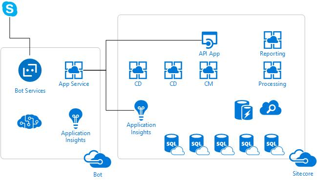

In all my SUGNL presentations I have a goal that I would like to inspire people or at least provide them with some great ideas or takeaways of value. On the 19th of Januari during my SUGNL presentation in the a-la-carte style at DigitasLBi I mentioned in one of the slides that I was creating a Bot that was able to operate Sitecore. The Bot should be able to at least notify me about those annoying “one-field-changed-publish-all”-users. That one slide triggered at least one person, Robbert Hock. After the presentation I had a chat with him and the proposal for the SUGCON Europe 2017 was a fact. We agreed in giving a duo presentation about the Microsoft Bot Framework.

Robbert was covering the framework itself and for that purpose he created an awesome Bot that could help you finding out about all sessions that were held during SUGCON Europe 2017. More about his awesome bot can be found on his blog ([https://www.kayee.nl/2017/07/03/sugcon-europe-2017-event-bot-video-recording-and-code/](https://www.kayee.nl/2017/07/03/sugcon-europe-2017-event-bot-video-recording-and-code/)). My part of the presentation was about leveraging Sitecore from a chat Bot perspective. Because of the limited timeframe of 45 minutes we couldn’t tell everything we knew about the Microsoft Bot Framework but trust me, we could talk hours about it! In this blog, I would like to dive deeper into the concept of the Sitecore Bot I created and the code behind it. Sharing is caring!

## The concept of the Sitecore Bot

First, I needed to outline what the Bot should be able to do. The ultimate Sitecore enabled Bot should be a part of the complete customer experience of course. In my opinion, a Chat Bot is one of the already forgotten pieces of brilliant engineering for creating an ultimate customer experience. For creating such a Bot, I would need a website that was holding enough information and experiences to be able to integrate with the Bot. I would have created one if the XConnect was available at that time, it would have saved me a lot of time. Not for that reason alone I decided to focus on leveraging the Bot Framework to operate Sitecore.

The focus should be the concept of the Bot and not creating an API that was too tightly being developed for a specific website. I chose to build a bot that needed an API for communication with Sitecore that anyone who has Sitecore running should be able to use! It shouldn’t matter if they are running their Sitecore on Microsoft Azure App Services or on-premise.

The following diagram shows a bit more where the Bot is located when you have a Sitecore running in Azure as PaaS, IaaS or a hybrid solution.

The Bot I created should be able to at least cover the following topics:

- Communicate in a secure way with Sitecore
- Authenticate the user in the conversation with Sitecore
- Use LUIS to determine the intentions and entities in the conversation
- Create Sitecore users
- Disable and enable Sitecore users
- Rebuild Sitecore indexes and notify the user about indexes being rebuild
- Publish Sitecore content and notify the user about publish events
- Get some data out of the XDB
- Get some data out of the Sitecore logs via Application Insights

This was quite a list of features and this blog will cover all of those.

The code for this Bot will be available on [GitHub](https://github.com/avwolferen/SitecoreBot). Changes to this repository may occur at any time.

## Registering the Bot with Microsoft Bot Framework Bot Directory

When you want to create a Bot you need at least two things. First you need to have your Bot hosted somewhere. For my Bot I choose Microsoft Azure because that’s what you choose when you want to create a Bot that communicates with an Azure hosted Sitecore environment. I first created a new project from the Bot Framework project template that you can find in the Bot Builder SDK for .NET on [https://docs.microsoft.com/en-us/bot-framework/dotnet/bot-builder-dotnet-overview](https://docs.microsoft.com/en-us/bot-framework/dotnet/bot-builder-dotnet-overview)

After creating the simple Echo Bot I published it to Microsoft Azure so I had the address that I needed for registering my Bot. To register the Bot with Microsoft’s Bot Directory you need to register yourself first at [https://developer.microsoft.com/](https://developer.microsoft.com/). After that you are able to register your newly created Bot. First you need the Messaging endpoint for your bot, for your Bot this could be something like [https://my-awesome-bot.azurewebsites.net/api/messages](https://my-awesome-bot.azurewebsites.net/api/messages). Next you need to get the Microsoft App Id and password for your Bot. This is used for Bot Authentication. This means that no one is able to communicate with your Bot’s messaging API if they don’t have those credentials. For debugging purposes you also need those in your emulator.

## Read more!

You can read the following blogposts about the Sitecore enabled Bot I created for the SUGCON presentation:
