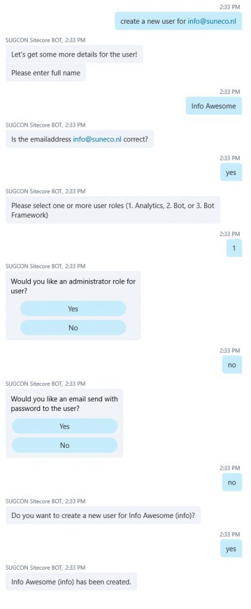

"We have created a Bot for you!" doesn't mean "We have created 300 if-statements for you!". Microsoft Cognitive Services gives you LUIS and you must use this Language Understanding Intelligent Service, aka LUIS, to understand and break up the conversation.

## Using a Language Understanding Intelligent Service (LUIS) Model

Now that we’re able to authenticate the user with Sitecore we can start by adding “smarts” to our Bot. These smarts are the APIs that you would like to cover in your Bot. To guide your conversation to the right implementation you really need to use a proper way to prevent using the “We have created a bot for you” meaning known as “We actually implemented a few hundred IF-THEN statements.”. A great way to do this is by using a LUIS Model to cover all your intents and use the Language Understanding to analyze and break up the utterances to recognize and guide your conversation.

For this Bot I have created a LUIS Model that contains 19 intents, 6 entities and a lot of labeled utterances. That means that the model can recognize 19 different sentences in all kinds of writings. Those 19 can be split up into the custom Sitecore APIs I created for my Bot. These vary from getting a list of users to getting XDB data out of Sitecore. I’ve extracted the LUIS Model and added it to the GIT Repository. For more about LUIS I suggest to read Robbert Hock's blog about LUIS at [https://www.kayee.nl/2017/05/15/sugcon-europe-2017-session-on-microsoft-bot-framework/](https://www.kayee.nl/2017/05/15/sugcon-europe-2017-session-on-microsoft-bot-framework/)

## Making a comprehensive wizard by using FormFlow to create new Sitecore users

“Create a new user”, wouldn’t that be cool to say to your bot?

Analyzing the conversation and interpreting the right intent of what you as the user of the bot want is the power of the Bot Framework as mentioned in the previous part of this blog series. If you would like to ask the bot if it can create a user for you then you can just ask him in all kind of ways. By using LUIS you are able to recognize the right intent the user wants to achieve, but next to that it is able to dissect the utterance and isolate entities out of the utterance. If I would simply want to create a new user I could ask the bot to do so. But if I would like to create a new user with a specific username or email address I could put that in my question. LUIS is also capable of giving entity recommendations based on the text it has analyzed.

“Create a new user for john.doe@domain.com” for example will be classified as the “Create User” intent based on the utterance “Create a new user for \[email\]”. The recommended entity will be “john.doe@domain.com” and the type will be email. You can use this information when you handle the intent.

In the Microsoft Bot Builder SDK there is a lot of brilliant functionality available. One of the great examples of this is FormFlow which lives in Microsoft.Bot.Builder.FormFlow.

FormFlow provides you with natural guidance and help and gives you more options with less effort. You can use FormFlow to create both simple and complex forms. These forms will be prompted to the user in a way that is highly user friendly. It is capable of giving you feedback on answers from the user that aren’t understood correctly by the Bot.

A classic example of this is when you are trying to book a hotel room. Common questions are asked and these answers are used to eventually book your room. These questions vary from asking about the number of people staying, the arrival and departure dates and the extra amenities you would like to use during your stay. If the Bot asks the user for the arrival date and the answer the user provides doesn’t meet the requirements of a date then the power of FormFlow jumps in and says that it couldn’t understand what the user meant and will ask the user again what the arrival date should be. FormFlow also supports navigation through steps, required, optional and conditional fields, and much more.

For the Sitecore Bot I used FormFlow to guide the user in creating a new user. There are multiple ways for prefilling the FormFlow. You can ask to just create a new user or you can provide a username or email address right away. If you provide an email address then the Bot will check if a user with the name part of the email address already exists. If it doesn’t exist it will use this for the username of the user to create. During the conversation FormFlow will ask the user if the username that was provided should be used.

```
var model = new Models.Forms.CreateUser();
EntityRecommendation emailaddress;
if (result.TryFindEntity(Entities.BuiltIn_Email, out emailaddress))
{
    model.EmailAddress = emailaddress.Entity.ToLowerInvariant();

    var suggestedUsername = model.EmailAddress.Split('@')[0];
    var exists = await Sitecore(context.AccessToken()).UserExists(suggestedUsername);
    if (!exists)
    {
        model.UserName = suggestedUsername;
    }
}

var createUserForm = new FormDialog<Models.Forms.CreateUser>(model, Models.Forms.CreateUser.BuildForm, FormOptions.PromptInStart);

context.Call(createUserForm, CreateUser_Callback);
```

We can ask the Bot in three different variants to create a user.

“Create a new user” which start the FormFlow asking every single question.

“Create a new user awesomeuser” which knows the username but will ask to confirm this.

“Create a new user for awesomeuser@somedomain.com” which knows the username and email address already but asks to confirm this.

```
[LuisIntent(Intents.Create_User)]
        public async Task CreateUser(IDialogContext context, LuisResult result)
        {
            var isAuthenticated = await context.IsAuthenticated();
            if (!isAuthenticated)
            {
                context.SetUnauthorizedMessageText(result.Query);
                await context.Forward(new AuthenticationDialog(), this.ResumeAfterAuth, context.MakeMessage(), CancellationToken.None);
            }
            else if (context.IsAdministrator())
            {
                var model = new Models.Forms.CreateUser();
                EntityRecommendation emailaddress;
                if (result.TryFindEntity(Entities.BuiltIn_Email, out emailaddress))
                {
                    model.EmailAddress = emailaddress.Entity.ToLowerInvariant();

                    var suggestedUsername = model.EmailAddress.Split('@')[0];
                    var exists = await Sitecore(context.AccessToken()).UserExists(suggestedUsername);
                    if (!exists)
                    {
                        model.UserName = suggestedUsername;
                    }
                }

                var createUserForm = new FormDialog<Models.Forms.CreateUser>(model, Models.Forms.CreateUser.BuildForm, FormOptions.PromptInStart);

                context.Call(createUserForm, CreateUser_Callback);
            }
        }

        private async Task CreateUser_Callback(IDialogContext context, IAwaitable<Models.Forms.CreateUser> result)
        {
            var create = await result;

            var response = await Sitecore(context.GetProfile().AccessToken).CreateUser(create);

            if (response.Success)
            {
                await context.PostAsync($"{create.FullName} ({create.UserName}) has been created.");
            }
            else
            {
                await context.PostAsync($"{create.UserName} couldn't be created because {response.Message}.");
            }

            context.Wait(MessageReceived);
        }
```

Within FormFlow forms you can add custom validators like checking if the username provided doesn’t already exist.

```
public enum UserRole
    {
        User,
        Analytics,
        Bot,
        BotFramework
    }

    [Serializable]
    public class CreateUser
    {
        [Pattern(@"^([\w-]+(?:\.[\w-]+)*)@((?:[\w-]+\.)*\w[\w-]{0,66})\.([a-z]{2,6}(?:\.[a-z]{2})?)$")]
        public string EmailAddress;

        public string FullName;

        [Pattern(@"^[_a-zA-Z0-9]+$")]
        public string UserName;

        public List<UserRole> UserRoles;

        public bool? AdministratorRoleForUser;

        public bool? EmailSendWithPasswordToTheUser;

        public static IForm<CreateUser> BuildForm()
        {
            var form = new FormBuilder<CreateUser>()
                .Message("Let's get some more details for the user!")
                .Field(nameof(FullName))
                .Field(nameof(UserName), validate: async (state, value) =>
                {
                    var exists = await SitecoreUserManagementAPI.Instance().UserExists((string)value);
                    return new ValidateResult { IsValid = !exists, Value = value, Feedback = exists ? $"Username {value} is already taken." : $"Lucky you! Username {value} is available!" };
                })
                .Field(nameof(EmailAddress))
                .Confirm("Is the emailaddress {EmailAddress} correct?")
                //.Field(nameof(IsAdministrator), prompt: "Do you want this user to be an administrator?")
                .AddRemainingFields()
                .Confirm("Do you want to create a new user for {FullName} ({UserName})?");

            form.Configuration.DefaultPrompt.ChoiceStyle = ChoiceStyleOptions.Buttons;

            return form.Build();
        }
    }
```

Keep in mind that you could also use FormFlow outside a Bot!



## Read more!
