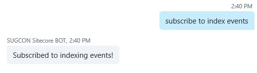
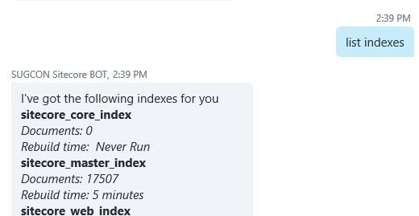
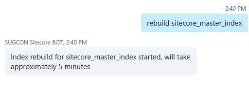
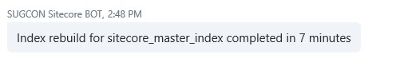

Rebuilding indexes, who doesn’t do this on almost a daily base? Logging into Sitecore, navigate to the control panel, opening the indexing manager and check that index you would like to rebuild. From that moment it is just waiting for it to finish.

## Using the Microsoft Bot Framework for rebuilding Sitecore indexes

How cool would it be if you were able to rebuild indexes by asking your Bot and receive a notification when it is ready? Well, it can easily be done. For listing the indexes and rebuilding indexes I’ve created a simple API that returns interesting information about the available indexes. You can rebuild a specific index just by asking.

But this is not where rebuilding indexes stops. You really need to get some feedback when Sitecore finishes rebuilding an index. For this purpose, I’ve created a Notification API on the side of the Bot that can be used by Sitecore to let a conversation know that an index rebuild is ready. Rebuilding an index and getting feedback with that API is straightforward from that point on.

Subscribing to index events? Be careful! Keep in mind that when you have this enabled you will also receive index updates, not single item updates, in the middle of the night.

Getting a list of all the indexes with the number of documents and estimation of the time needed for the rebuild.

Initiating an index rebuild in this case for the sitecore\_master\_index can be instructed with a simple command. The Bot will confirm the rebuild start and the estimate of the time it should take.

When the index rebuild finished Sitecore will let you know.

## Read more!
