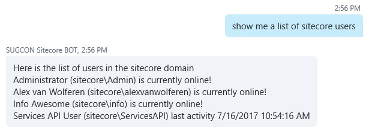
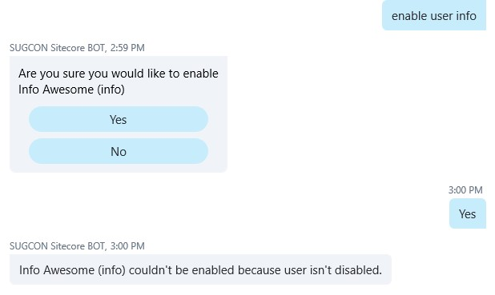
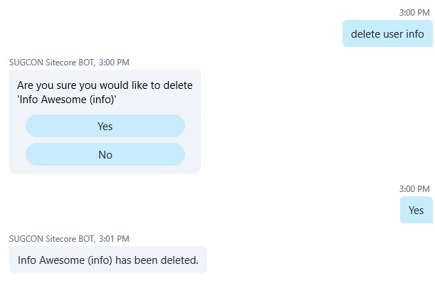
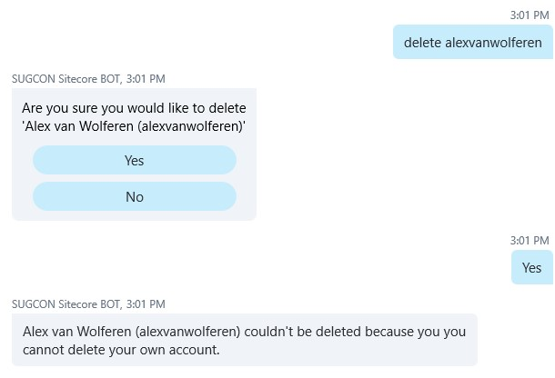

Managing Sitecore users normally requires you to log into Sitecore, navigate to the User Manager and lookup the specific user. This could also be done with the bot.

## Sitecore User Management with the Microsoft Bot Framework

Whether you would like to create, delete, disable or enable users in Sitecore you could also ask the Bot to do that for you in your UserContext.

Getting a list of users in a specific domain.

Trying to enable a user that isn’t disabled at all gives a proper response.

Deleting a user is also straightforward.

And if you would like to delete your own account, the API prevents you from doing that.

## Read more!
