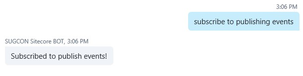
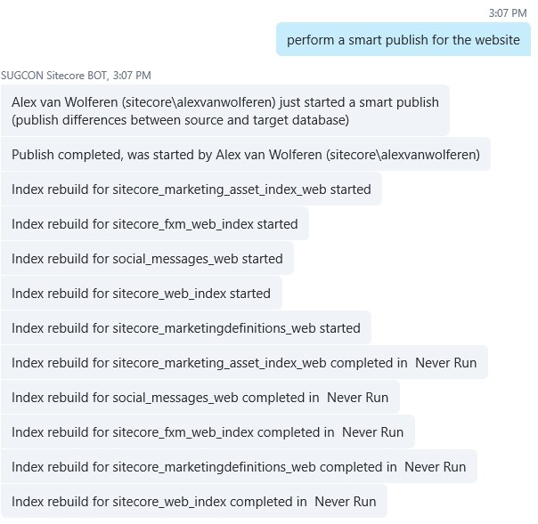
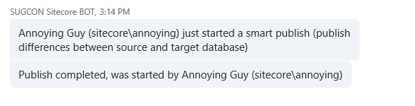
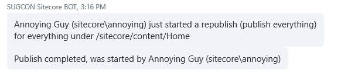

Publishing specific items or just the entire database? Just ask a Bot and it will be done.

## Publishing your website with the Microsoft Bot Framework

I’ve implemented several intents for publishing activities. If you would like to perform a publish and get notified on publish events of others you can use the Bot. The notifications work the same as the notifications for the indexing events.

When we perform a smart publish to our web database Sitecore will notify me when it is completed. Because I am also subscribed to the indexing events Sitecore will let me know about several indexes that get updated.

Now that moment is there when that annoying content editor is performing unnecessary publishes. Sitecore will notify you on that.

Or when it gets worse and the annoying guy is attempting to drastically publishing stuff.

Now is the time that you really need to disable that user and ask him what he’s up to.

## Read more!
