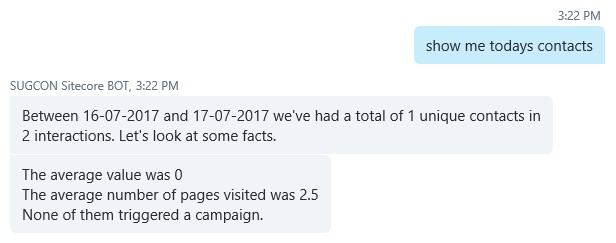
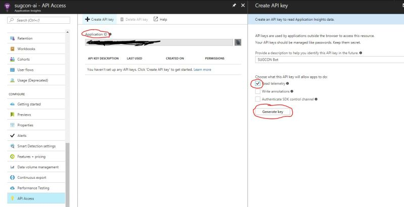
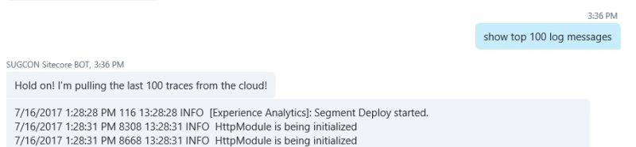

How cool would it be if you could get XDB data out of Sitecore just using a simple instruction to your bot?

## Getting XDB data out of Sitecore using a Bot

Why shouldn’t you be able to tell your Bot “show me todays contacts”. You could. By using LUIS I can also as how many contacts we had on a specific day or period in time.

This data is being retrieved from the XDB with a simple MongoDB query.

## Getting Sitecore Log information out of Application Insights

Since Sitecore made their best decision ever turning their platform into an Azure App Service the logging also moved to an Azure friendly solution, Application Insights. As Application Insights has a preview API that you can use to get metrics from your application I’ve made the Bot able to get data out of that API. How cool would it be to get the last log records from the Sitecore log? You can just ask Sitecore about the last number of lines. For this you only need to configure the API Access on Application Insights in the Azure Portal and add the Application ID and the generated key to the configuration file of the API on the Sitecore end.

After this you can ask your bot for log data.

## Conclusion

Creating a Bot with the Microsoft Bot Framework to leverage Sitecore is awesome and can be used for unlimited purposes.

The next bot I will be building will be integrated with the entire Customer Journey and will really be influenced by the Customer Experience and totally integrated with Sitecore from a customer’s perspective.
