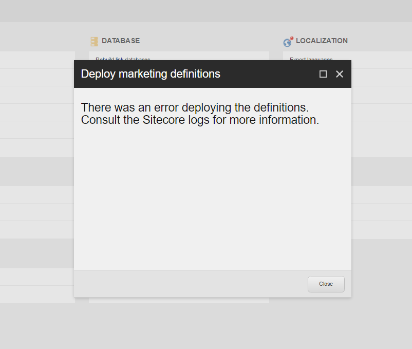
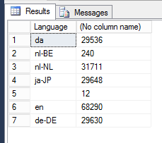
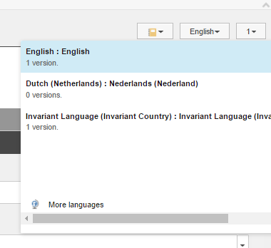
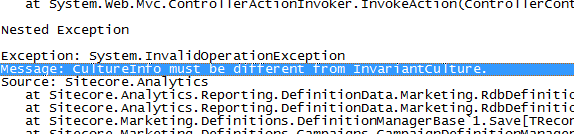
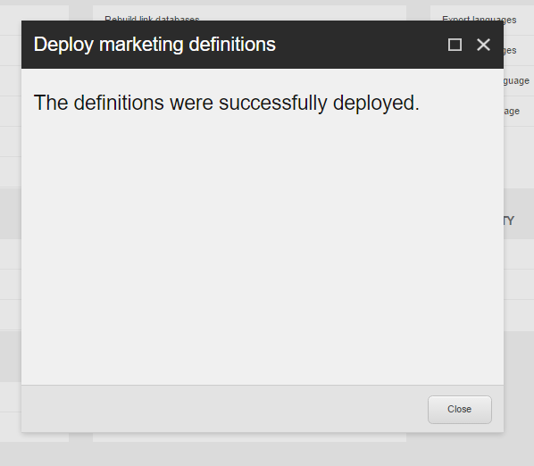

Ever stumbled upon unexplainable errors while working with Sitecore? Exotic exceptions can and will appear in your Sitecore logs when you are working with migrated content from other Sitecore environments.

Imagine a situation where you find yourself in the position where you have imported a large amount of content from one solution to another and to get things working you have also migrated the marketing definitions. Then to be sure you don’t miss out anything so you will perform the famous “deploy marketing definitions” for obviously deploying marketing definitions from your master database to the reporting database and notice that it is somewhat oversensitive to exceptions.

## _The error occurred on you!_

If you just have migrated content from one environment to another and especially when you have included marketing definitions, like goals and campaigns, then you really want to be sure these can be found throughout Sitecore. The processing server needs these definitions to be available and also the content delivery instances need them to be available. Otherwise you can stumble upon missing profile keys or campaigns and goals not being available to be scored and tracked.

When you are missing definitions in your databases you could get the following error when visiting a webpage.

```
Exception: System.InvalidOperationException
Message: Key 'Technical Profile Key' does not exist in this pattern space
Source: Sitecore.Analytics
   at Sitecore.Analytics.Patterns.PatternSpace.GetKeyIndex(String key)
   at Sitecore.Analytics.Patterns.SumPatternMapper.GetPoints(PatternSpace space, IProfileData values)
   at Sitecore.Analytics.Patterns.PatternSpace.CreatePattern(IProfileData profile)
   at System.Linq.Enumerable.<>c__DisplayClass7_0`3.<CombineSelectors>b__0(TSource x)
   at System.Linq.Enumerable.WhereSelectArrayIterator`2.MoveNext()
   at System.Linq.Enumerable.FirstOrDefault[TSource](IEnumerable`1 source)
   at Sitecore.Analytics.Data.Items.ProfileItem.get_MappedPatterns()
   at Sitecore.Analytics.Data.Items.ProfileItem.MatchPattern(IProfileData profile, IPatternDistance distance)
   at Sitecore.Analytics.Tracking.Profile.UpdatePattern()
```

When you are trying to resolve this issue you will probably decide to deploy the marketing definitions from the master database to the marketing definition repositories. This could be done by using the “Deploy marketing definitions” option in the Control Panel of Sitecore. This deployment should lead into a successful deployment. If the deployment happens to fail then you will be prompted with the following message and exception in your Sitecore log.



The Sitecore log should give you something like this:

```
Exception: System.AggregateException
Message: One or more errors occurred.
Source: mscorlib
   at System.Threading.Tasks.Task.ThrowIfExceptional(Boolean includeTaskCanceledExceptions)
   at System.Threading.Tasks.Task.Wait(Int32 millisecondsTimeout, CancellationToken cancellationToken)
   at Sitecore.Analytics.Reporting.DefinitionData.Marketing.Deployment.DeploymentManager.DeployAll[TDefinitionInterface](CultureInfo culture)
   at Sitecore.Shell.Client.Applications.Marketing.Utilities.DeployMarketingDefinitions.DeployMarketingDefinitionsController.DeployDefinitionTypes(String[] definitionTypes)
   at Sitecore.Shell.Client.Applications.Marketing.Utilities.DeployMarketingDefinitions.DeployMarketingDefinitionsController.DeployDefinitions(String definitionTypes, Boolean publishTaxonomies)
   at lambda_method(Closure , ControllerBase , Object[] )
…
Nested Exception
                Exception: System.InvalidOperationException
Message: CultureInfo must be different from InvariantCulture.
```

## _Figuring out what is wrong_

If you look into the exceptions than you will find “CultureInfo must be different from InvariantCulture” the most useful sign for the cause of this issue. Something is wrong with cultures of Sitecore items. Like everybody should know Sitecore is multilingual and you can add languages to Sitecore and remove them if you know what happens when you remove languages and how to perform a proper language removal.

At this point I took a peek into the master database of my Sitecore instance and executed a query to see which languages and how many records there were present in Sitecore.

```
SELECT DISTICT [Language], COUNT(*) as [FieldCount] FROM dbo.VersionedFields group by [Language]
```

This gave me the exact answer to my problem.



My problem was that my database contained fields in versions of languages that wasn’t a valid language. I needed to get rid of those records. First I checked what Sitecore said about the version in the Content Editor.



You can see that there is no valid Dutch version  available but there is one version available that has the Invariant Language and Invariant Country. Aha! That’s actually what I was seeing in my exception!! Remember?



I knew I had to fix this and I was quite sure I could easily delete those records from the database without causing any harm. But to be sure, read the following message and take precautions.

**Warning! Make sure you backup your master database and inform your users of a short interruption of their businesses concerning the Content Management server.**

The deleted query was executed without any problems.

```
DELETE FROM dbo.VersionedFields WHERE [Language] = ''
```

The results stated that there were 12 records deleted and because I had deleted records from the database which Sitecore itself did not knew anything about, because Sitecore caches items like crazy, I had to either recycle the application pool or give the website a virtual kick in the nuts by editing the web.config. If you wish you could publish your database and the records will be deleted from the web pools.

The next thing to do is to hit the button again in for deploying the marketing definitions.


It could take a while and when it does,  its going. The successful results should look like the following dialog:



Almost instant success!


If you don’t succeed in applying this solution, you should contact me so I could assist you in finding the solution that fits you best!

One very important thing to mention is that I’ve experience issues with Sitecore not properly closing SQL connections when the processing server or deployment of marketing definitions failed on me. This happened to cause problems with free connections in the connections pool and I got tons of exceptions in my logs. I’m pretty sure that not only those are taken care of right now, but also the marketers will be pretty happy with this solution as in the proper profiles are available on the content delivery machines because they all got deployed.
