Developers often need to work their way through Sitecore logs while developing Sitecore stuff. Since there are a lot of those locations and log categories you need to spend as little time as possible to keep a look at those files. There are multiple solutions possible to work with log files but my personal preference is using Visual Studio Code and the Log Viewer extension by Bernardo.

## **How to set this up**

If you do not have Visual Studio Code installed yet go to [https://code.visualstudio.com/](https://code.visualstudio.com/) and download it there for free. After downloading and installing Visual Studio Code go to the Extensions tab or press CTRL+SHIFT+X.

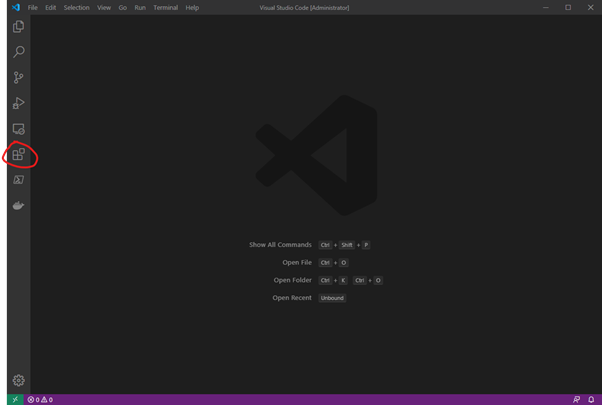

Search for “log viewer” and select and install the very first searchresult “[Log viewer](https://gitlab.com/berublan/vscode-log-viewer)” by Bernardo.

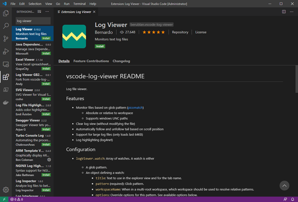

After this you can go and configure Log Viewer. I do this by editing the user settings.json file. You can get there by pressing CTRL + ,  
You will be prompted with the Settings overview that will look like this.

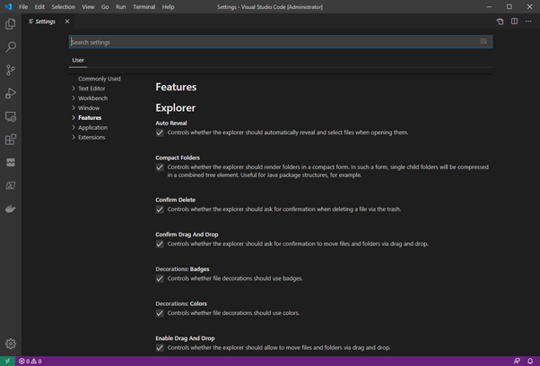

Now navigate to “Extensions” and select “Log Viewer Configuration”.

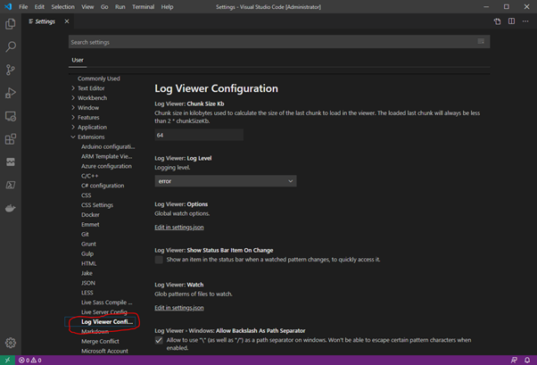

Now tick the checkbox for “Show Status Bar Item On Change”. This will give you a nice placeholder where you can add your configuration for your logs.

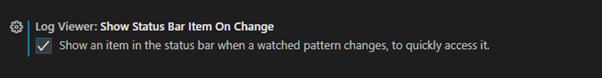

Next press “Edit in settings.json” in the “Log Viewer: **Watch**” section.  
Replace the “logViewer.watch” assignment with the following configuration.

```
    "logViewer.watch": [
        {
            "title": "Sitecore 9.3 Log",
            "pattern": "C:\\inetpub\\wwwroot\\sc93sc.dev.local\\App_Data\\logs\\log.*.txt"
        },
    ],
```

Pretty easy and straightforward but make sure you fix the absolute paths to your Sitecore instance. Your json should look something like this.

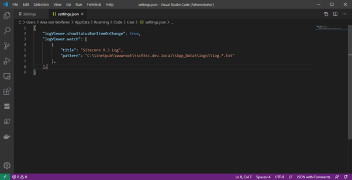

Now hit CTRL+S to save your changes and go to the Log Viewer Extension on the left side of your screen.

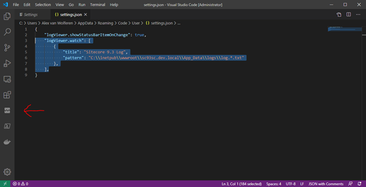

You will see the watch you just have configured. Select “Sitecore 9.3 Log” and you will see the contents of the log.

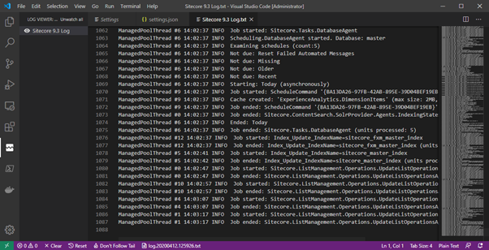

You can choose to close the log “Sitecore 9.3 Log.txt” because we just configured that we would like to see a status bar item on change. Let’s see if we can see that working.  
I just hit publish from my Sitecore desktop and I see the notification.

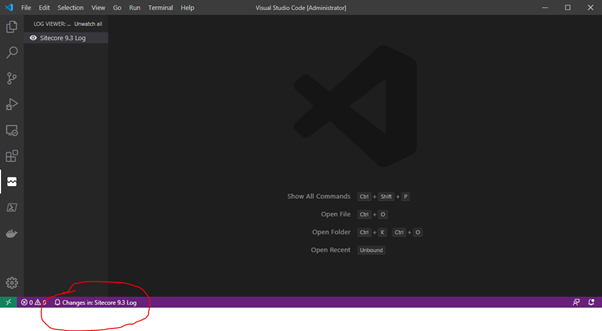

Clicking on that notification opens the related log.

## Highlights in your log files


Because Sitecore creates the log files with the file extension .txt it is hard for the Log Viewer to auto-detect the file as a log file. Now for some extra you can choose to highlight text in your (txt) log file. To make this happen you just need to select the type of document you are looking at when you have the Sitecore 9.3 Log open.

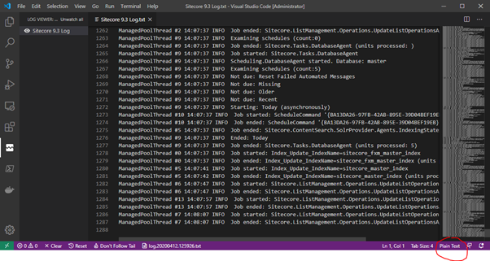

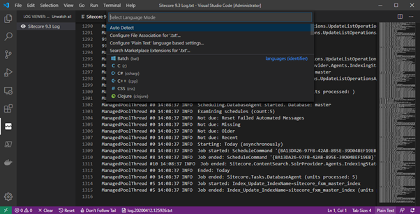

Search for “Log” and select the item that says “Log file (log-viewer)”.

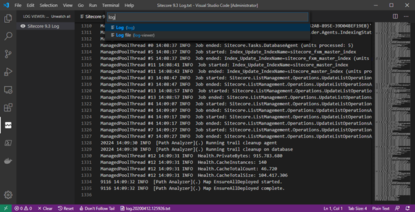

We get highlights right away.

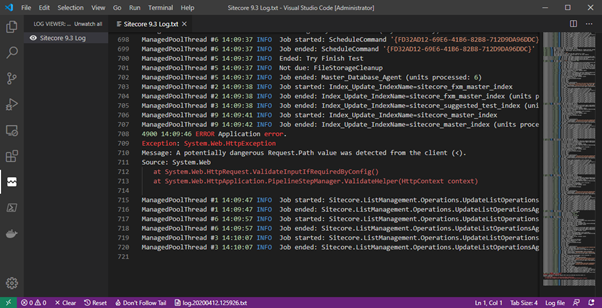

Now for a more advanced configuration you would probably watch all Sitecore core Logs and xConnect, Index Worker, Automation Engine and Processing Engine logs. Let’s do that with the settings file again. Go to the settings and replace the logviewer configuration with the following contents.

```
    "logViewer.watch": [
        {
            "groupName": "Sitecore 9.3 Core",
            "watches": [
                {
                    "title": "Sitecore Log",
                    "pattern": "C:\\inetpub\\wwwroot\\sc93sc.dev.local\\App_Data\\logs\\log.*.txt"
                },
                {
                    "title": "Sitecore Aggregation Log",
                    "pattern": "C:\\inetpub\\wwwroot\\sc93sc.dev.local\\App_Data\\logs\\Aggregation.log.*.txt"
                },
                {
                    "title": "Sitecore EXM Log",
                    "pattern": "C:\\inetpub\\wwwroot\\sc93sc.dev.local\\App_Data\\logs\\Exm.log.*.txt"
                },
                {
                    "title": "Sitecore Publishing Log",
                    "pattern": "C:\\inetpub\\wwwroot\\sc93sc.dev.local\\App_Data\\logs\\Publishing.log.*.txt"
                },
            ]
        },
        {
            "groupName": "Sitecore 9.3 IdentityServer",
            "watches": [
                {
                    "title": "Identityserver Log",
                    "pattern": "C:\\inetpub\\wwwroot\\sc93identityserver.dev.local\\logs\\sts*.log"
                },
            ]
        },
        {
            "groupName": "Sitecore 9.3 XDB",
            "watches": [
                {
                    "title": "xConnect Log",
                    "pattern": "C:\\inetpub\\wwwroot\\sc93xconnect.dev.local\\app_data\\logs\\xconnect-log-*.txt"
                },
                {
                    "title": "Automation Engine Log",
                    "pattern": "C:\\inetpub\\wwwroot\\sc93xconnect.dev.local\\app_data\\jobs\\continuous\\AutomationEngine\\App_Data\\Logs\\*.txt"
                },
                {
                    "title": "Index Worker Log",
                    "pattern": "C:\\inetpub\\wwwroot\\sc93xconnect.dev.local\\app_data\\jobs\\continuous\\IndexWorker\\App_Data\\Logs\\*.txt"
                },
                {
                    "title": "Processing Engine Log",
                    "pattern": "C:\\inetpub\\wwwroot\\sc93xconnect.dev.local\\app_data\\jobs\\continuous\\ProcessingEngine\\App_Data\\Logs\\*.txt"
                },
            ]
        }
    ],
```

We just added three groups in the settings file. Each group is identified by a groupName. It's nothing more then adding an extra layer in the configuration.  
Save the settings and you will directly see the new log categories showing up in the Log Viewer extension.

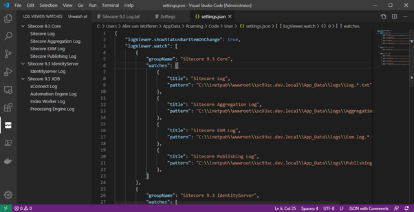

You can now choose to watch as many categories as you would like. Make sure you only watch the essential categories and when you need to look at the other interesting categories. Of course, there are more categories available in Sitecore but since the configuration is easily done in Visual Studio Code you will work your way through these. Also remember that not all log files have the .log file extension so you probably need to select the Log File type for your newly added categories.

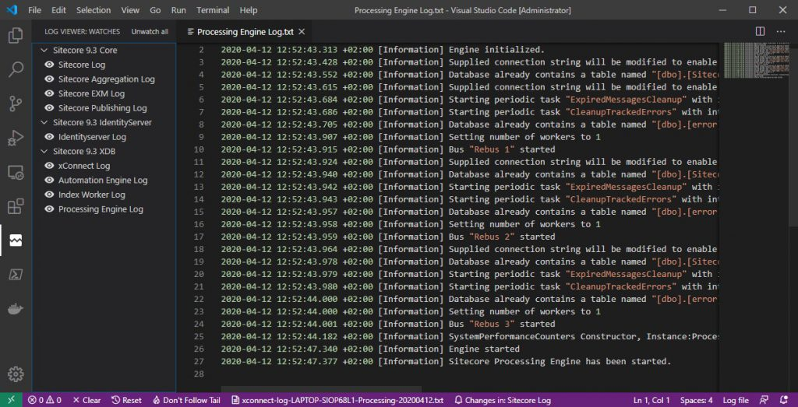

## What you have learned from this blog?

- Using Visual Studio Code for looking at your log files
- Creating easy configurations for the Log Viewer
- Using status bar item to alert you on log file changes that you have under your watch
- Having highlighted patterns in your Sitecore Core (.txt) log files
- How to create groups in your Log Viewer configuration
- Saving precious time!

Happy coding! Stay healthy and safe!
