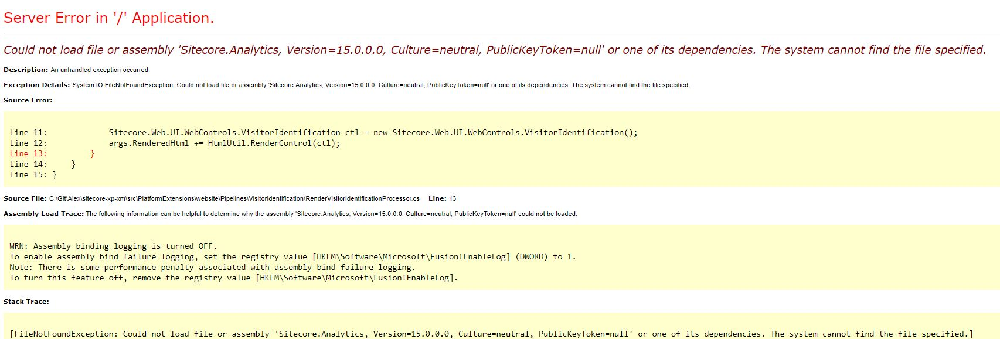

When you are working on a Sitecore solution that could make the move from Sitecore Experience Platform (XP) to Sitecore Experience Manager (XM) there are some limitations and things you really need to consider.

## Build once, deploy many!
This blogpost shows you how you can provide some flexibility when you are building platforms that need to be able to run on Sitecore XP as well as on Sitecore XM without changing the way that you do the VisitorIdentification.

Look at the code on [GitHub](https://github.com/avwolferen/sitecore-xp-xm) or proceed reading this blogpost.

## Easy peasy, XM squeezy
XM in short consists of a subset of features that the XP offers you. A few things that are not available are the Sitecore Analytics, Marketing and xDB components. This makes XM cheaper in terms of hosting compared to XP.
Going for an XM is a serious option if you want to go for a simpler Sitecore topology which it is becoming more popular lately. It comes in several flavours, but the thing is that it only consists of just a few databases, a Standalone or ContentManagement and ContentDelivery role and it lacks the Reporting, Processing and all the xConnect roles and databases.

## Saving money on teamstreets
Maybe you have multiple team environments that you use fo feature development where you might think that running a full blown Sitecore XP1 is too much overkill and even a Standalone XP0 would introduce extra costs that you might not want to take.

## The underlying issue of missing components
Because the omision of all Sitecore Analytics / Marketing related asssemblies in Sitecore XM you cannot just deploy and run your Sitecore XP targeted solutions directly on Sitecore XM without failure. One of the key things in XP is the VisitorIdentification. Being able to run this requires you to introduce a lot of assemblies that you don't want on your XM instances, and that is where this solution finds its place.

## Running the VisitorIdentification in a pipeline
What I basically did is create a custom pipeline, processor, introduce a feature-toggle and SitecoreHelper extension that does the magic by making use of rule-based configuration. This will prevent you from running into Yellow Screen Of Death (YSOD) situations.

There are just a few things that you need to do to make this work in your solution.

## Adding the topology appsetting
Sometimes you need to make decisions while coding to enable or disable functionality. The easiest way on using feature toggles in Sitecore is by using rule-based configuration. More about this can be read in the official Sitecore documentation about [Rule-based configuration](https://doc.sitecore.com/developers/101/platform-administration-and-architecture/en/rule-based-configuration.html)

To be able to toggle features based on the topology you need to add one single appsetting to your web.config or the appSettings on your AppService. 

Sitecore XP
```xml
<add key="topology:define" value="xp" />
```
Sitecore XM
```xml
<add key="topology:define" value="xm" />
```
For the code on GitHub it is not required but it makes it more elegant. The code is pretty forgiving so forgetting this toggle does not give you any issues at all. Not forgetting this keeps your platform fast and sound.

## Introducing the pipeline
To overcome the issue of the assemblies I've created a simple pipeline and processor that takes care of the rendering of the HTML that is required for the VisitorIdentification. This pipeline is extendible if you require this. The most important one is that the processor is only effective with the use of rule-based configuration in Sitecore.
```c
    public class VisitorIdentificationPipeline
    {
        public const string pipelineName = "platformextensions.visitorIdentification";

        public static string Run()
        {
            string result = string.Empty;
            try
            {
                var args = new VisitorIdentificationPipelineArgs();
                CorePipeline.Run(pipelineName, args);
                result = args.RenderedHtml;
            }
            catch (System.Exception ex)
            {
                Sitecore.Diagnostics.Log.Error($"Possible misconfiguration of the feature toggle for topology:define.", ex, typeof(VisitorIdentificationPipeline));
            }

            return result;
        }
    }
```
You might ask yourself "Why adding this try/catch construction?" Well, I'll get back to that later in this blogpost.

## The processor

The processor that I wrote is simple and looks a lot like the real deal.

```c
    public class RenderVisitorIdentificationProcessor : VisitorIdentificationBase
    {
        public override void Process(VisitorIdentificationPipelineArgs args)
        {
            Condition.Requires(args, "args").IsNotNull();
            Sitecore.Web.UI.WebControls.VisitorIdentification ctl = new Sitecore.Web.UI.WebControls.VisitorIdentification();
            args.RenderedHtml += HtmlUtil.RenderControl(ctl);
        }
    }
```
For the people that want to extend the pipeline, you might want to use the VisitorIdentificationBase.
```c
    public abstract class VisitorIdentificationBase
    {
        public abstract void Process(VisitorIdentificationPipelineArgs args);
    }
```

And the configuration.
```xml
<configuration xmlns:x="http://www.sitecore.com/xmlconfig/" 
               xmlns:patch="http://www.sitecore.com/xmlconfig/" 
               xmlns:topology="http://www.sitecore.com/xmlconfig/topology/" >
  <sitecore>
    <pipelines>
      <!-- This pipeline is intended to render just the VisitorIdentification control. You can add your own logic to this pipeline but keep in mind that none of the Analytics, Marketing or xConnect assemblies are available.-->
      <platformextensions.visitorIdentification>
        <!-- Renders the Visitor Identification control -->
        <processor type="AlexVanWolferen.PlatformExtensions.Pipelines.VisitorIdentification.RenderVisitorIdentificationProcessor, AlexVanWolferen.PlatformExtensions" 
                   topology:require="!xm"
                   patch:before="*[1]" />
      </platformextensions.visitorIdentification>
  </pipelines>
  </sitecore>
</configuration>
```

## Update your views
Please update all your view where you use the safe VisitorIdentification. Because the regular VisitorIdentification cannot be used you need to replace it with the safe and compatible one.

The SitecoreHelper extensionmethod that you are going to use looks like this.
```c
    public static class VisitorIdentificationExtensions
    {
        public static HtmlString SafeVisitorIdentification(this SitecoreHelper sitecoreHelper)
        {
            var renderedHtml = Pipelines.VisitorIdentification.VisitorIdentificationPipeline.Run();
            return new HtmlString(renderedHtml);
        }
    }
``` 
And for the changes in your Razor views replace the using:
```c
@using Sitecore.Mvc.Analytics.Extensions
``` 
with
```c
@using AlexVanWolferen.PlatformExtensions.Extensions 
```

And update the usage of the VisitorIdentification itself, so replace:
```c
@Html.Sitecore().VisitorIdentification()
```
with
```c
@Html.Sitecore().SafeVisitorIdentification()
```

## Publish your code to your site
Publish your code and do not forget to double check the web.config!

Always test this on your local environment before rolling it out to other stages.

## Could not load file or assembly Sitecore.Analytics
If you somehow forgot to add the feature toggle in the appSettings topology:define then you might find an exception logged that it cannot load the Sitecore.Analytics assemblies. 

```text
13704 23:16:57 ERROR Possible misconfiguration of the feature toggle for topology:define.
Exception: System.IO.FileNotFoundException
Message: Could not load file or assembly 'Sitecore.Analytics, Version=15.0.0.0, Culture=neutral, PublicKeyToken=null' or one of its dependencies. The system cannot find the file specified.
Source: AlexVanWolferen.PlatformExtensions
   at AlexVanWolferen.PlatformExtensions.Pipelines.VisitorIdentification.RenderVisitorIdentificationProcessor.Process(VisitorIdentificationPipelineArgs args)
   at (Object , Object )
   at Sitecore.Pipelines.CorePipeline.Run(PipelineArgs args)
   at Sitecore.Pipelines.DefaultCorePipelineManager.Run(String pipelineName, PipelineArgs args, String pipelineDomain, Boolean failIfNotExists)
   at Sitecore.Pipelines.DefaultCorePipelineManager.Run(String pipelineName, PipelineArgs args, String pipelineDomain)
   at AlexVanWolferen.PlatformExtensions.Pipelines.VisitorIdentification.VisitorIdentificationPipeline.Run() in C:\Git\Alex\sitecore-xp-xm\src\PlatformExtensions\website\Pipelines\VisitorIdentification\VisitorIdentificationPipeline.cs:line 15

```

I made this kind of fool proof by adding some exception handling to the pipeline and not in the processor, because then it will still try to load the Sitecore.Analytics assembly and catching that is just not elegently possible. Otherwise you might still get this YSOD.



## Create nuget packages?
You might want to give the two nuspec files a go. These will give you the power of the install.ps1 to update all your Razor views when installing the package.

## Update your views with PowerShell?
You could also use the PowerShell script as a start for your own PowerShell script.
```ps
param($installPath, $toolsPath, $package, $project)

Write-Output "Installpath $installPath"
Write-Output "Toolspath $toolsPath"
Write-Output "Package $package"

$projectFilePath = $project.FullName
Write-Output "ProjectFilePath $projectFilePath"

$projectDirectory = [System.IO.Path]::GetDirectoryName($projectFilePath)
Write-Output $projectDirectory

$razorViewFiles = Get-ChildItem -Path $projectDirectory -Filter "*.cshtml" -Recurse -File

Write-Output "Found $($razorViewFiles.Length) cshtml files"
foreach ($razorViewFile in $razorViewFiles)
{
    $razorViewFilePath = $razorViewFile.FullName
    $output = @()
    $lines = Get-Content -Path $razorViewFilePath
    [string]$oneliner = $lines
    if ($oneliner.Contains('@using Sitecore.Mvc.Analytics.Extensions'))
    {
        Write-Output "Processing file $($razorViewFilePath)"

        ## Add using
        foreach ($line in $lines) {
            $line = $line.Replace('@using Sitecore.Mvc.Analytics.Extensions', '@using AlexVanWolferen.PlatformExtensions.Extensions')
            $line = $line.Replace('@Html.Sitecore().VisitorIdentification()', '@Html.Sitecore().SafeVisitorIdentification()')
                
            $output += $line
        }
        
        $output | Set-Content -Path $razorViewFilePath
    }
}
```
## GitHub repository
The code is available on [GitHub](https://github.com/avwolferen/sitecore-xp-xm)

# Happy coding!
Please share this blogpost if you liked it, I really appreciate it.