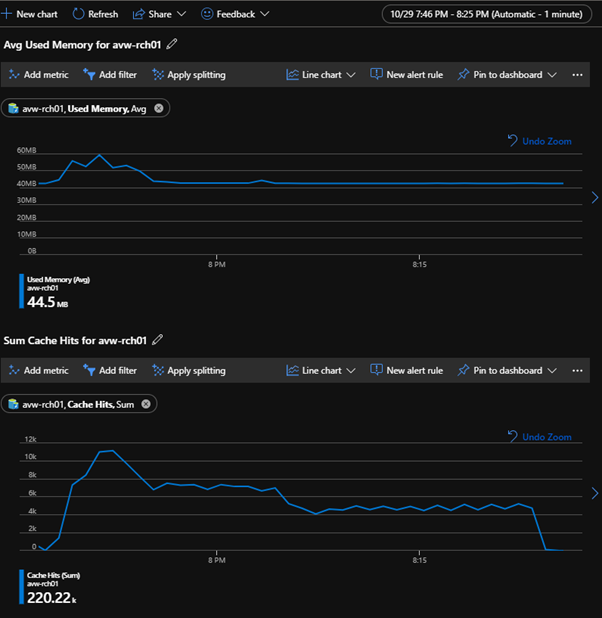
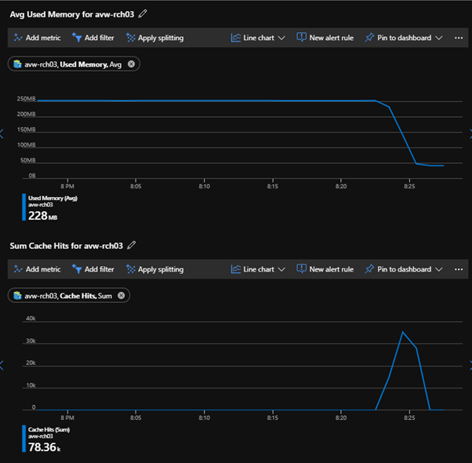
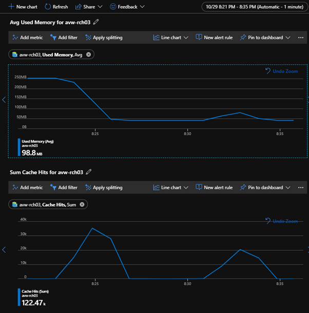
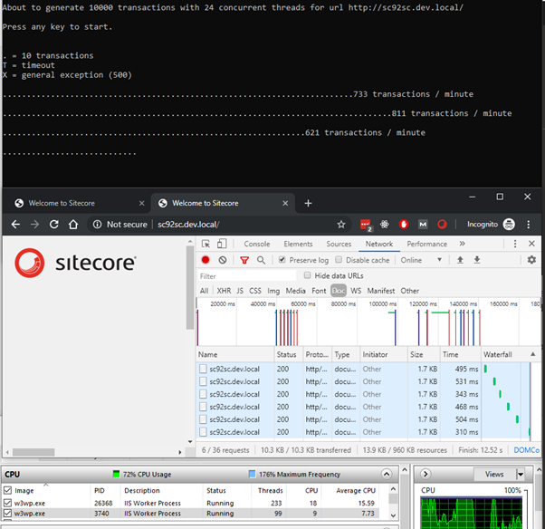
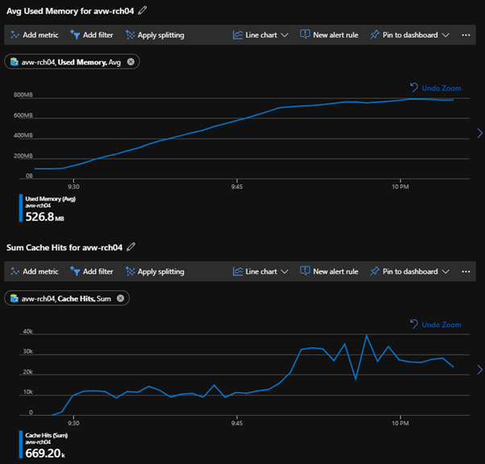
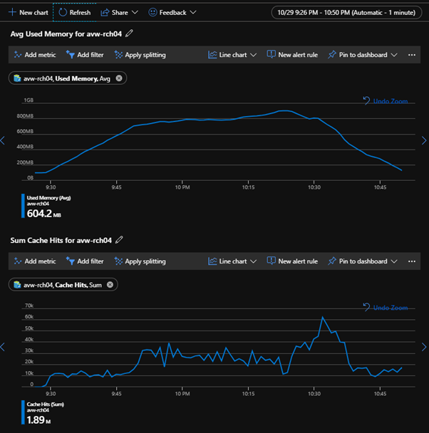
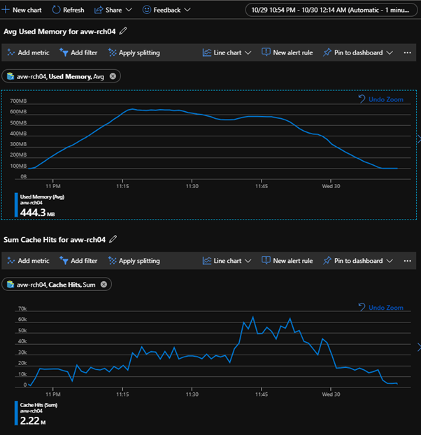
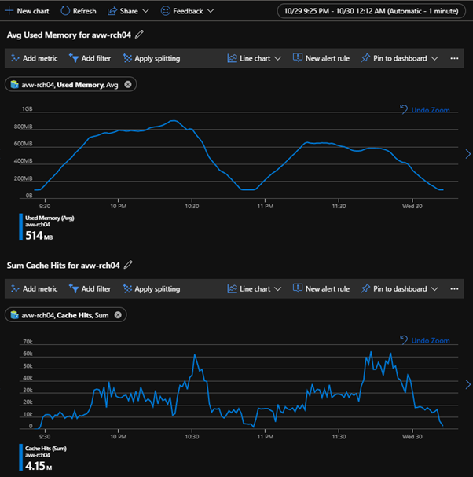

Azure Redis Cache and the RedisSessionStateProvider, and especially the SessionExpirationThreadCount setting. It all has to do with a better thread management for SessionExpiration that is configurable starting from 9.2 off the shelf.

This issue is introduced by Microsoft in the .NET 4.7.2 framework. Unfortunately you cannot fix this issue when you are running Sitecore on Azure. Please also read [https://kb.sitecore.net/articles/327701](https://kb.sitecore.net/articles/327701) for more in depth information about this.

## TL;DR

Dealing with Sitecore platforms in Azure or On-premise you always want to scale out. Just add extra instances to deal with the load that your visitors generate. To leverage this in Azure is just a simple slider that you can move and press the save button. Not big of a deal. Right? But when you want your visitors to seamless move back and forth between all your instances you need something like a SessionStateProvider. With Sitecore 9.0 you have several options. There is the old-school SqlSessionstateProvider where back in the days (on-premise) you could do some magic by not using physical tables but in-memory tables to stop generating disk i/o. A session still is something volatile and if it is still there until the session expires then you are pretty much set. Next to the SqlSessionStateProvider there is also the MongoSessionStateProvider. That one should work similar. But if we want to take things seriously, we could use the RedisSessionStateProvider because of Azure Redis Cache.

> Redis is an open source (BSD licensed), in-memory data structure store, used as a database, cache and message broker. It supports data structures such as strings, hashes, lists, sets, sorted sets with range queries, bitmaps, hyperloglogs, geospatial indexes with radius queries and streams. Redis has built-in replication, Lua scripting, LRU eviction, transactions and different levels of on-disk persistence, and provides high availability via Redis Sentinel and automatic partitioning with Redis Cluster
> 
> Source: [https://redis.io](https://redis.io/)

If you take a look at the introduction of Redis on their website it ticks all the boxes.  
✓ Open Source  
✓ In-Memory  
✓ Used as a database  
✓ Cache  
✓ Built-in replication  
✓ Transactions

Hoorah! This is the thing to have in your platform!

So let’s see how this holds off in a real-life generated scenario. I would like to see a lot of sessions being spun off, have them fill up my cache, and after all get those sessions expired, so I can see them in my shards.

### **Test scenarios**

There are four scenarios that I would like to test:

- A: Sitecore 9.0.1 - Shared and private session (uncompressed) in Azure Redis Cache – service tier C0 (250MB)
- B: Sitecore 9.2 - Shared and private session (uncompressed) in Azure Redis Cache – service tier C0 (250MB)
- C: Sitecore 9.2 - Shared and private session (uncompressed) in Azure Redis Cache – service tier C1 (1GB)
- D: Sitecore 9.2 - Shared and private session (compressed) in Azure Redis Cache – service tier C1 (1GB)

All scenarios are performed from the same machine and internet connection. We are not primarily interested in the performance but in a fluent ramp-up and ramp-down of our cache hits. Because if the go mad, they will be going up and down like crazy.

Machine: Intel(R) Core(TM) i7-8750H CPU @ 2.20GHz – 16GB RAM  
Internet connection: 250/50

For 9.0.1 (A) versus 9.2 (B) I used:

- Polling interval 2 minutes
- Session expiration 1 minute
- 24 threads, 5000 transactions max, 10 minutes max

For 9.2 uncompressed (C) versus 9.2 compressed (D) I used:

- Polling interval 2 minutes
- Session expiration 20 minute
- 24 threads, 50000 transactions max, just over an hour

I wrote a simple console application that I won’t provide you with (just talk to me next week in Orlando 😉). The tool generates a series of requests so Sitecore will accept me as a real visitor. I’m only interested in the page with well-known lady with the tablet and some extra requests. In this tool I can choose how many transactions I would like to execute and how many concurrent threads I would like to spend on this. After pressing the button it will show the progress and when there happens to be a timeout or an unhandled exception it will report it just with a T or X. For every 10 transactions it will report with a . (period) and every minute it shows the number of transactions it handled during that minute. Just easy peesy putting a heavy load on my Sitecore instance.

The reason I did this test was to see what the impact is of issue [https://kb.sitecore.net/articles/464570](https://kb.sitecore.net/articles/464570) where not only the session expiration will go mad and start to spin off new threads because it runs into timeouts on the Redis connection.

Please note that because my internet connection is pretty stable, I won’t suffer from many network issues during this test. I could decrease the timeouts on the RedisSessionStateProvider but I didn’t want to take that variable into account anyway. Just for comparing the Thread Management on Redis Expiring Sessions and the comparison between 9.0.1 and 9.2.

. = 10 transactions  
T = timeout  
X = general exception (500)

### (A) **Sitecore 9.0.1 C0 uncompressed**

Raw results. Skip this table if you want to see the metrics.

Running 1500 transactions.

<table class="wp-block-table"><tbody><tr><td>........................................</td><td>408 transactions / minute</td></tr><tr><td>.....................T</td><td>188 transactions / minute</td></tr><tr><td>...........................T.TT...</td><td>332 transactions / minute</td></tr><tr><td>.....................&nbsp;</td><td>195 transactions / minute</td></tr><tr><td>..........T.X..............&nbsp;&nbsp;&nbsp;&nbsp;&nbsp;&nbsp;&nbsp;&nbsp;&nbsp;&nbsp;&nbsp;&nbsp;&nbsp;&nbsp;&nbsp;&nbsp;&nbsp;&nbsp;&nbsp;&nbsp;&nbsp;&nbsp;&nbsp;&nbsp;&nbsp;&nbsp;</td><td>263 transactions / minute</td></tr><tr><td>......&nbsp;&nbsp; &nbsp;&nbsp;&nbsp;&nbsp;&nbsp;&nbsp;&nbsp;&nbsp;&nbsp;&nbsp;&nbsp;&nbsp;&nbsp;&nbsp;&nbsp; &nbsp;&nbsp;&nbsp;&nbsp;&nbsp;&nbsp;&nbsp;&nbsp;&nbsp;&nbsp;&nbsp;&nbsp;&nbsp;&nbsp;&nbsp;&nbsp;&nbsp;&nbsp;&nbsp;&nbsp;&nbsp;&nbsp;&nbsp;&nbsp;&nbsp;&nbsp;&nbsp;&nbsp;&nbsp;&nbsp;&nbsp;</td><td>59 transactions / minute</td></tr><tr><td>T.TTTX.</td><td>28 transactions / minute</td></tr><tr><td>TTT.&nbsp;&nbsp;</td><td>3 transactions / minute</td></tr><tr><td></td><td>0 transactions / minute</td></tr><tr><td>TTT&nbsp;&nbsp;&nbsp;&nbsp;&nbsp;&nbsp;&nbsp;&nbsp; &nbsp;&nbsp;&nbsp;&nbsp;&nbsp;&nbsp;&nbsp;&nbsp;&nbsp;&nbsp;&nbsp;&nbsp;&nbsp;&nbsp;&nbsp; &nbsp;&nbsp;&nbsp;&nbsp;&nbsp;&nbsp;&nbsp;&nbsp;&nbsp;&nbsp;&nbsp;&nbsp;&nbsp;&nbsp;&nbsp;&nbsp;&nbsp;&nbsp;&nbsp;&nbsp;&nbsp;&nbsp;&nbsp;&nbsp;&nbsp;&nbsp;&nbsp;&nbsp;&nbsp;&nbsp;&nbsp;</td><td>3 transactions / minute</td></tr><tr><td></td><td>0 transactions / minute</td></tr><tr><td>TTT&nbsp;</td><td>2 transactions / minute</td></tr><tr><td>TT</td><td>2 transactions / minute</td></tr><tr><td></td><td>0 transactions / minute</td></tr><tr><td>TT..</td><td>17 transactions / minute</td></tr></tbody></table>

Completed 1500 sessions in 879.8008793 seconds.

The metrics are not looking that stable, I sure did put a pretty consistent load on the web app. This also doesn't tell us anything why the performance wasn't consistent in terms of transaction per minute.



In our Sitecore log we find a huge number of overriding expired contact session locks. Seems like it is unable to override it anyway. It keeps flooding the logs for hours.

7704 20:22:26 WARN  Overriding expired contact session lock for contact id: 1678f1fd-a5b8-474e-b94a-7f791414497c  
7704 20:22:26 WARN  Overriding expired contact session lock for contact id: 1678f1fd-a5b8-474e-b94a-7f791414497c  
7704 20:22:27 WARN  Overriding expired contact session lock for contact id: 1678f1fd-a5b8-474e-b94a-7f791414497c  
7704 20:22:27 WARN  Overriding expired contact session lock for contact id: 1678f1fd-a5b8-474e-b94a-7f791414497c

### **(B) Sitecore 9.2 C0 uncompressed**

First draining the sessions that are still in the Redis Cache, they need to be processed after all 😊



During these 5 minutes the webpage was super-fast like it should.

Now for this run (1500 transactions) we are super-fast as well.

<table class="wp-block-table"><tbody><tr><td>...........................................XXX.X.XXX.X........................</td><td>685 transactions / min.</td></tr><tr><td>...............................................................................</td><td>814 transactions / min.</td></tr></tbody></table>

Completed 1500 sessions in 112.0475105 seconds.

Now that is quite a difference.

The exceptions were unfortunately timeouts because I had a short network hiccup. I could have increased the timeouts to prevent this and have this resolved in the retry mechanism.

```
31684 20:30:40 ERROR Exception: Timeout performing EVAL (5000ms), inst: 0, qs: 12, in: 0, serverEndpoint: Unspecified/avw-rch03.redis.cache.windows.net:6380, mgr: 10 of 10 available, clientName: LAPTOP-SIOP68L1, IOCP: (Busy=0,Free=1000,Min=12,Max=1000), WORKER: (Busy=12,Free=32755,Min=50,Max=32767), v: 2.0.519.65453 (Please take a look at this article for some common client-side issues that can cause timeouts: https://stackexchange.github.io/StackExchange.Redis/Timeouts)

31684 20:30:40 ERROR SetAndReleaseItemExclusive => StackExchange.Redis.RedisTimeoutException: Timeout performing EVAL (5000ms), inst: 0, qs: 12, in: 0, serverEndpoint: Unspecified/avw-rch03.redis.cache.windows.net:6380, mgr: 10 of 10 available, clientName: LAPTOP-SIOP68L1, IOCP: (Busy=0,Free=1000,Min=12,Max=1000), WORKER: (Busy=12,Free=32755,Min=50,Max=32767), v: 2.0.519.65453 (Please take a look at this article for some common client-side issues that can cause timeouts: https://stackexchange.github.io/StackExchange.Redis/Timeouts)
   ……………..
    at Sitecore.SessionProvider.Redis.RedisSessionStateProvider.SetAndReleaseItemExclusive(HttpContext context, String id, SessionStateStoreData item, Object lockId, Boolean newItem)
```

The metrics are also nice.



The first large set of cache hits was because of the expired sessions from a previous test. Let’s see what happens if we do hit that Max Memory limit. 10000 transactions and 24 threads for the load generator it is!

During this test I did get some results on random doc requests.



The raw results from this test are pretty good, no timeouts or exceptions.

Completed 10000 transactions in 801.8971407 seconds. That’s an average of 748 transactions per minute.

### **_Uncompressed (C) versus compressed_** (D)

250MB for a Redis Cache is pretty small, should not be used for a production setting of course. For this test I choose the Standard C1 tier and set the session timeout to the regular 20 minutes to get a higher memory usage on the Redis Cache. I also went for 50000 transactions, for the sake of hitting the Max Memory. Let's see what compression does with the performance.

In this comparison we should expect a higher CPU load on the webserver but that is not taken into account for this test. We are only interested in the actual number of transactions and see whether we are hitting a certain limit accessing Redis. It makes sense that the actual memory usage of Redis is lower in the compressed test compared to the uncompressed test. Based on the content of these tests we should not expect that many differences, there is not much to compress after all.

#### (C) Sitecore 9.2 C1 uncompressed

The Memory usage on Redis is creeping up relatively fast to its Maximum of 1GB. But after 20 minutes the growth comes to a halt and the session expiration is taking his part of the cookie Redis Cache.



You need to do more than this simple test to get above the 1GB, just add some unique data to the session for instance like real interactions. After one hour we only see a lot of activity on Sitecore and xConnect. We have processed 45.453 transactions in 54 minutes, that’s an average of 841.7 transactions per minute.

The test started at 9:28 and was stopped at 10:22. After that only the expired sessions were causing the cache hits.



But if we check the logs we still see a couple of contacts that are giving issues. They appear a couple of thousand times in the Sitecore log file.

```
19264 22:19:37 WARN  Overriding expired contact session lock for contact id: f1172f10-42f9-492a-9a71-60e2d4c316f2
4708 22:19:37 WARN  Overriding expired contact session lock for contact id: ca7161be-964d-4921-b413-9aff91ff973e
6952 22:32:32 WARN  Overriding expired contact session lock for contact id: 8ca465fe-9131-4c82-8dd4-f0dfbde8ffe2
29220 22:32:32 WARN  Overriding expired contact session lock for contact id: 38bd9441-0ef8-437f-8e7e-373ae2cbac07
18532 22:32:32 WARN  Overriding expired contact session lock for contact id: f6806e5c-13ae-4c84-9fac-d3636ccdf674
11784 22:32:32 WARN  Overriding expired contact session lock for contact id: cdf5c02a-f96f-47b9-9d43-bc42d38a2e61
```

#### **Sitecore 9.2 C1 compressed** (D)



Completed 50000 sessions in 3257.2035205 seconds. That’s an average of 921 transactions per minute.

If we compare them side by side, we don’t see that big difference except for the lower memory usage of course. Take into account that we are not doing anything special in the session. Just three quick hit and runs in an interaction for a brand-new contact.



If you look at the metrics and especially the Cache Hits you will see the effect of a better thread management for the session expiration. In 9.2 during the heavy load not that much effort was put into the expired sessions. When the load was completed, the expired sessions got more attention and got processed by Sitecore. In 9.0.1 there was a continuous amount of cache hits during the entire load and also after the load when there were only expired sessions to process.

#### Result comparison

As you can see in the results the main difference is the number of transactions that I was able to put on Sitecore per minute in this case, taken into consideration that I am using Azure Redis Cache from my local machine so add some latency. Mileage may vary.

<table class="wp-block-table"><tbody><tr><td>Sitecore version</td><td>9.0.1</td><td>9.2</td><td>9.2</td><td>9.2</td><td>9.2</td></tr><tr><td>Redis Cache</td><td>C0<br>250MB</td><td>C0<br>250MB</td><td>C0<br>250MB</td><td>C1<br>1GB</td><td>C1<br>1GB</td></tr><tr><td>(Un)compressed</td><td>U</td><td>U</td><td>U</td><td>U</td><td>C</td></tr><tr><td>Transactions</td><td>1.500</td><td>1.500</td><td>10.000</td><td>50.000</td><td>50.000</td></tr><tr><td>Transactions completed</td><td>1.476</td><td>1.492</td><td>10.000</td><td>45.453</td><td>50.000</td></tr><tr><td>Transactions failed</td><td>24</td><td>8</td><td>0</td><td>0</td><td>0</td></tr><tr><td>Threads</td><td>12</td><td>12</td><td>24</td><td>24</td><td>24</td></tr><tr><td>Time taken (minutes)</td><td>14:40</td><td>1:52</td><td>13:22</td><td>54:00</td><td>54:15</td></tr><tr><td>Avg. Transactions<br>per minute</td><td>102,3</td><td>802,6</td><td>748</td><td>841,7</td><td>921</td></tr><tr><td>Timeouts* / Exceptions**</td><td>22 / 2</td><td>0 / 8</td><td>0 / 0</td><td>0 / 0</td><td>0 / 0</td></tr></tbody></table>

\* WebRequest timeouts  
\*\* Redis timeouts

#### Timeouts on Redis and thread count going mad

Not only will 9.0.1 run into issues when the timeouts are causing a bad experience but also your website itself will become unresponsive because the retry mechanism will take up a lot of your threads of the App Service. The behavior can be seen if you take a look at the metrics (Thread Count) of your App Service in combination with Azure Redis Cache hits. When there are issues during the processing of expired sessions it will go into the retry mechanism that spins up a new thread. Because threads have a certain limit, which you can configure of course. Changing the TheadPool Configuration during App Initialization doesn’t solve this issue at al. It just makes your app service become sooner unresponsive.

In Sitecore 9.2 you are able to configure the thread count that is responsible for processing expired sessions. Those numbers are very important and they solve this issue.

> Change the value of the SessionExpirationThreadCount setting in the \\App\_Config\\Sitecore.config file to specify how many threads should process the work items in the queue when a session expires.  
> Change the value of the maxConcurrencyLevel setting in the Web.config file to specify how many threads should handle session expiration logic.
> 
> Source: [https://kb.sitecore.net/articles/464570](https://kb.sitecore.net/articles/464570)

The main reason why you should go to 9.2 asap is that you don’t want someone with a silly console app ruin your websites availability in an environment.

Please do let me know if you have experienced the same in a comparison or if you have extra data or links to mention.

See you next week in Orlando? Cheers!
