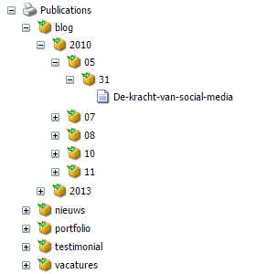
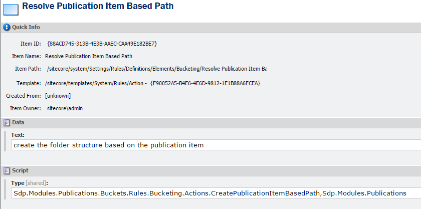
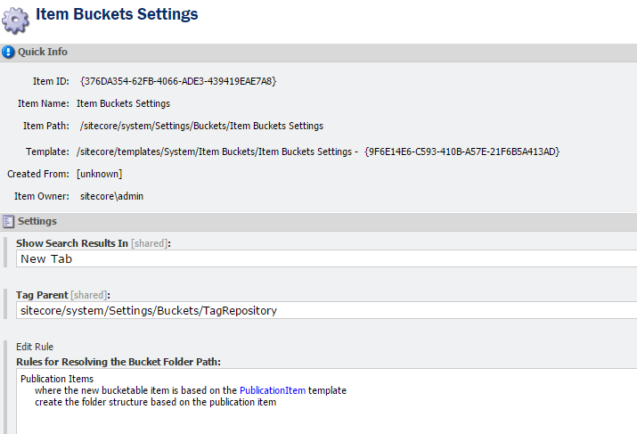
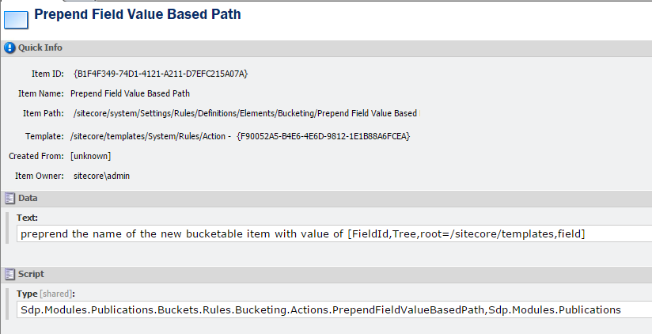
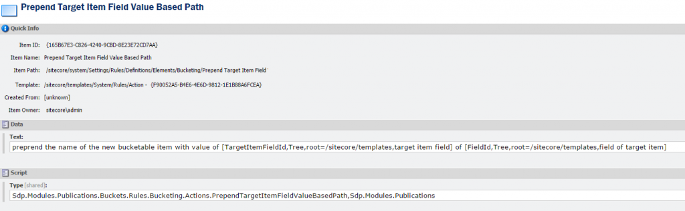
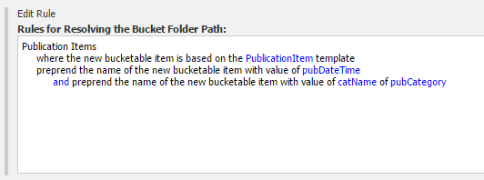

In Sitecore 7.5 there are great new features available like the settings for Item Buckets and especially conditions and actions for resolving the Bucket Folder Path. This way we could influence the way our Bucket Folder Paths are generated based on Sitecore's great Rules Engine.

## _Bucket Folder Paths that make sense_

In Sitecore 7.5 there are great new features available like the settings for Item Buckets and especially conditions and actions for resolving the Bucket Folder Path. This way we could influence the way our Bucket Folder Paths are generated based on Sitecore's great Rules Engine. We can create different Bucket structures for bucketable items that are based on specific templates, or when the name of our Bucket matches certain rules. Out of the box we can base the Bucket Folder Path on the creation date of the new bucketable item in a specific format, or based on the ID of the new bucketable item (the item ID will be used and will generate folder structures like “A/3/F/E/2”, etc.), or just use the name of the item in de same way to get some structure that is interpret-able to humans “s/i/t/e/c/o” etc.

## _Publications in categories_

This is cool and even better when we implement our own actions for these rules. In our solution we have a bucket that holds our publication items. The template on which these publications are based on contain a field in which the category is set. This field is shared, so in all languages this field holds the same value. We also have a publication date field available in our template, this field is also shared.

The reason we use this Bucket is that we have a lot of publication items to store and we’re not really interested in how our publication items are stored in Sitecore. There are some cons and pros about Item Buckets but that would go far beyond this blog.

But to get some grip on the structure we want to get the following:

With the actions that came out of the box we weren’t able to do this so we need to create our own actions. We could make an action that is a tight fit with our Publication Item template but that will be a quick and dirty solution. We could also make two generic actions which you can use to make this work. But hey, why the rush? This blog will cover both situations.

## _Tight fit action_

For creating and using our tight fit solution we need to do three things:

1. Create a piece of code
2. Create the item for our action
3. Make the action work with our Item Bucket Settings

We need to create an action that does the following. First we stop our action if we’re not dealing with an item that is not based on our Publication Item template. Next we need to get our item from the database because our actual item isn’t passed into our action. If we’re dealing with an item that has to be created then we’re not getting our item from the database because it isn’t created yet. If we’re working with an item that has already been created, for example the item is moved into the bucket, then we can get the item from the database. If the item is new we use DateTime.Now as our value, if the item already existed then we take the value of the DateField “pubDate”. If that field has no value then we take DateTime.Now. Next we need to determine the category where would like to see in our Bucket Folder Path. For this value we get the item our category field is pointing at and when have that Category Item we take the Category Name field from that item. If no category had been set we take a default value “Uncategorized”. After this we assemble our path by adding the values to a simple list of strings and set the outcome of the string.Join method on our parts to the ResolvedPath property of the ruleContext.

Next we define the action in Sitecore. We create an item of the Template “/sitecore/templates/System/Rules/Action” and set the text with “create the folder structure based on the publication item” and the Type to our newly create action. 

Now we have our action and we need to setup our Item Bucket Settings.

If we go to our Bucket and hit the sync button then we see our structure working like a charm.

## _Different rules per language?!?_

But there is one thing you should be aware of, the “Rules for Resolving the Bucket Folder Path” isn’t a shared field. You will need to set this rules for every language.

## _Just one “Item Buckets Settings” item to rule them all?_

Out of the box in Sitecore 7.5 there can be only one Item Buckets Settings item, but of you really would like to get the ability of creating multiple settings items you should take a look at the Sitecore.Buckets.Util.BucketFolderPathResolver. You should be able to get all the defined rules in the Item Buckets Settings items you create, combine them to one ruleslist and get them executed against the itemArray. But like Louis van Gaal said earlier “That’s another ‘biscuit’”.

## _Generic actions for Bucket Folder Path_

It would be more efficient if we create generic actions to make this Bucket Folder Path possible. Like we mentioned earlier we needed the value of a field of a referenced item and we needed the value of a DateField from the Bucketable item. We can do this with two separate actions that work based on prepending.

## _Prepend the value of a field_

First we create an action that gets the value of a certain field from our Bucketable item. I our situation we only act when the field is a shared field and in this case we use the value of a DateTime Field. The code we need is:

For our action definition we use the following:

Now we have our specific Date Field value from our item we still need the value of the Category Name field of the Category Item that our Item is referencing. This is a relatively simple action.

The action definition of this item looks a lot like the action for the Date Field.

Now we can replace the action in our Item Buckets Settings with our two new generic actions.

If we run the sync command on our Bucket we’ll see it work like a charm.

## _Conclusion_

We’re quite happy with the new Item Buckets Settings. There are some things we would like to mention.

- The rules you set are language dependent, the field is simply not shared. 
- Bucket strategies do need to be aware of field that are not shared. If you have setup the exact same rule for two different languages and your action uses a field that isn’t shared you could end up with different folder paths depending on which version you are working with. Working with Item ID, Item Name or values of Shared Fields is quite safe.
- There is only one Item Buckets Settings item. We would like to see an out of the box solution where we can use multiple settings items with a certain hierarchy (conditions could interfere with each other).
- If we insert a new Publication Item in our bucket the item isn't created yet when we jump into our actions, this results in the "uncategorized" mode. We needed to add a item:saved event that acts on items based on the Publication Item template and in that action we move the item, again, back into the Bucket. This results in the conditions and actions being checked and performed and we end up with the correct path.
