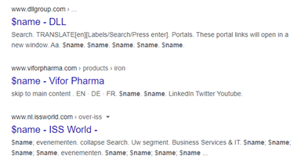
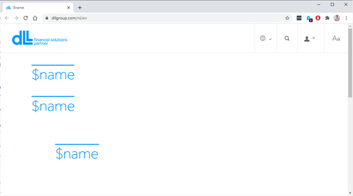
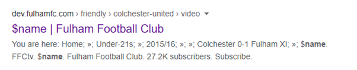
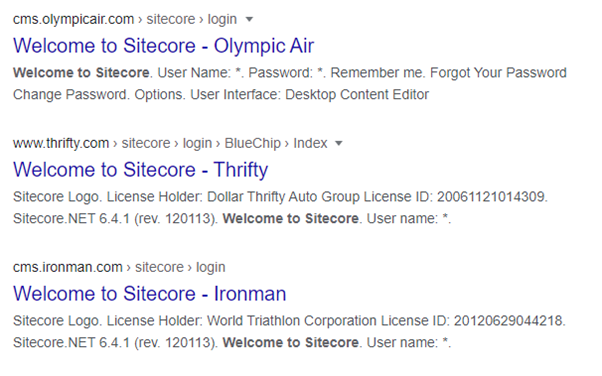
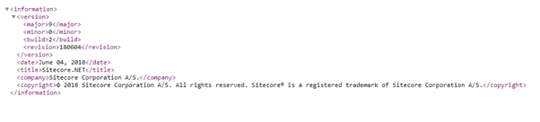
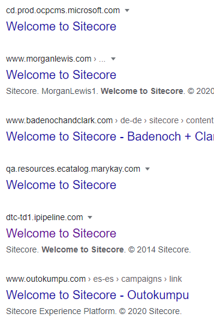
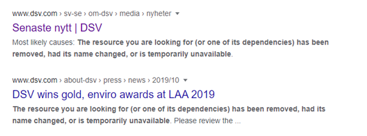
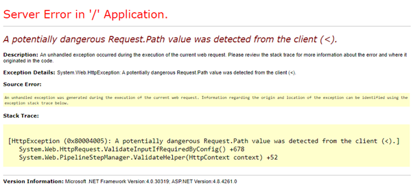

Adding new features and value to your Sitecore platform is always great. But sometimes people tend to lose focus on keeping it all nice and tidy. In this blog I provide you with some easy-to-use Google queries to keep a good look at things you do not want to find about your website.

## Disclaimer

The queries mentioned I extensively use not only to keep a good view on what things that might have been forgotten but also help peers to improve their indexed content on Google Search. Use the queries wisely, help each other, and get in contact on Sitecore Slack to notify each other. Please use this blog to only improve your websites.

After posting this blog I will try to reach out to the domains in the screenshots and/or Sitecore partners to inform them of these silly finding.

## Google Search is not just a crawler

Google Search is a great tool to keep improving your site. It does not only make your website findable by others, but it will also make your website accessible via an ever-growing list of smart devices that use Google Assistant, Alexa, Siri and so on. Your actual content really matters and keeping it all sounds and sane is particularly important these days. Take note of this (random) list of things you do not want to find on Google about your Sitecore site!

To get to know a lot more operators that you can use when searching on Google please take some time to read this post about [Google Search Operators: The Complete List (42 Advanced Operators](https://ahrefs.com/blog/google-advanced-search-operators/)).

## 1 Tokens in standard values

Try this in google  
`[site:*.com "$name"](https://www.google.com/search?q=site%3A*.com+%22%24name%22)`

**_Happens in non-production and in production environments_**

If you use Branch Templates or \_\_standard values, then you are familiar with tokens. If you do not know what tokens are in Sitecore please look at this fantastic piece ([https://community.sitecore.net/technical\_blogs/b/sitecorejohn\_blog/posts/expand-standard-values-tokens-in-existing-items-with-the-sitecore-asp-net-cms](https://community.sitecore.net/technical_blogs/b/sitecorejohn_blog/posts/expand-standard-values-tokens-in-existing-items-with-the-sitecore-asp-net-cms)) of a blog by the one and only John West.

If you are unlucky and you have introduced a standard value with a token after you have created a bunch of items based on that one you might end up with non-replaced tokens in your item. This can end up in a nasty looking page or even entire menu-structures that are messed up.

Find sites that might suffer from this with the forementioned Google Search Query. You can search for other tokens as well and your own custom tokens, but $date is used in the query language for MongoDB and in a lot of code examples.

## 2 Dev, test, staging subdomains

This query is combined with the previous one. Of you happen to have a particular line of text or any other line of text you can search for that explicit content as well.

Try this in google:  
`[site:dev.*.com "$name"](https://www.google.com/search?q=site%3Adev.*.com+%22%24name%22)`  
or  
`[site:stg.*.com "$name"](https://www.google.com/search?q=site%3Astg.*.com+%22%24name%22)`

Exposing non-production environments could potentially expose information that you rather not want to share before you go to production. New features, assets, even content or vulnerabilities can be exposed by simply forgetting to make it inaccessible to the public.

## 3 Sitecore login page

Try this in google:  
`[site:*.com/sitecore/login "Welcome to Sitecore"](https://www.google.com/search?q=site%3A*.com%2Fsitecore%2Flogin+%22Welcome+to+Sitecore%22)`

The login page does not only provide the possibility to login to your site, but it also contains version and license holder information because is it part of a hidden div on the page. Not many have this appear in Google Search results, but you might contact them and offer an upgrade 😉

Prevent this by adding the attributes runat=”server” and visible=”false” to the actual div with the license information (div id="licenseOptions") or starting from Sitecore 10 set the following setting to false.

`<!--  LOGIN DISABLE LICENSE INFROMATION  
            If true, Sitecore hides the "License Information" link on the login page.  
            Default: true  
      -->  
    <setting name="Login.DisableLicenseInfo" value="true" />`

## 4 Sitecore version

Related to the previous item. If you want to know what exact version they are using you can just hit the relative path to the version.xml  
/sitecore/shell/sitecore.version.xml

## 5 Welcome to Sitecore

Try this in google:  
`[site:*.com "Welcome to Sitecore"](https://www.google.com/search?q=site%3A*.com+%22Welcome+to+Sitecore%22)  
`or`  
[site:*.com "From a single connected platform that also integrates with other customer-facing platforms"](https://www.google.com/search?q=site%3A*.com+%22From+a+single+connected+platform+that+also+integrates+with+other+customer-facing+platforms%22)`

This looks silly, but try to make sure you have a good reason for this to stay there. Perhaps you could introduce a redirect on that particular item.

## 6 Cross-domain, cross-site indexed content

Try this in google:  
`[site:*.com/sitecore/content](https://www.google.com/search?q=site%3A*.com%2Fsitecore%2Fcontent)`

People tend to forget that an absolute path is easily resolved by the default ItemResolver. If you really do not want this to happen make sure you get rid of this behaviour by patching an easy to build ItemResolver that just redirects you to the root of the site if you happen to hit unwanted cross-site items.

Also keep in mind that you should always include the targetHostName attribute on your site definitions. These are used for generating the correct absolute Uri to the content item that you are refering to that might be located under the rootPath of a different website in your Sitecore instance.

## 7 Not found pages

Try this in google:  
`[site:*.com "The resource you are looking for (or one of its dependencies) has been removed, had its name changed, or is temporarily unavailable"](https://www.google.com/search?q=site%3A*.com+%22The+resource+you+are+looking+for+%28or+one+of+its+dependencies%29+has+been+removed%2C+had+its+name+changed%2C+or+is+temporarily+unavailable%22)`

It is just a silly thing, but it should not appear in Google.

## 8 Default .NET Error page

Something that is hardly ever found on Google indexes is the default .NET error page. If you happen to spend some time cuddling with customErrors and statusCodes in your web.config file, make sure you have a good static html fallback scenario for situations like URL’s with just a < in the URL. Test this scenario and prepare for these requests to never hit Sitecore because it has been hijacked by System Web RequestFiltering. [https://docs.microsoft.com/en-us/iis/configuration/system.webserver/security/requestfiltering/](https://docs.microsoft.com/en-us/iis/configuration/system.webserver/security/requestfiltering/)

## What you should always do and remember

1. The latest versions of Sitecore are more secure by default. But you should always take the **[security hardening guide](https://doc.sitecore.com/developers/100/platform-administration-and-architecture/en/security-guide.html)** seriously and take appropriate measures.
2. Make sure stages lower than production are not indexed at all
3. Make sure stages lower than production are not accessible from outside your companies’ boundaries.
4. Make sure you regularly scan your domains for unwanted content (lorem ipsum, $name, etcetera)
5. Make sure you have customError pages in place
6. Make sure you handle unexpected errors in your own code in a proper way
7. Make sure you use something like a reverse proxy to hide your actual azurewebsites.net or other hosting mechanism. Yes, this blog is (still) hosted on Azure but I do not have a staging environment or anything else to hide.
8. Subdomains are predictable

To prevent search indexing to be performed you can of course set the robot instructions on your pages, or in your robots.txt, but the best thing of course is to make your non-production environment inaccessible from outside your own company boundaries.

I hope you have enjoyed this blogpost and please share it as much as possible to keep each other sharp on at least these 8 things you do not want to find on Google about your Sitecore sites.
