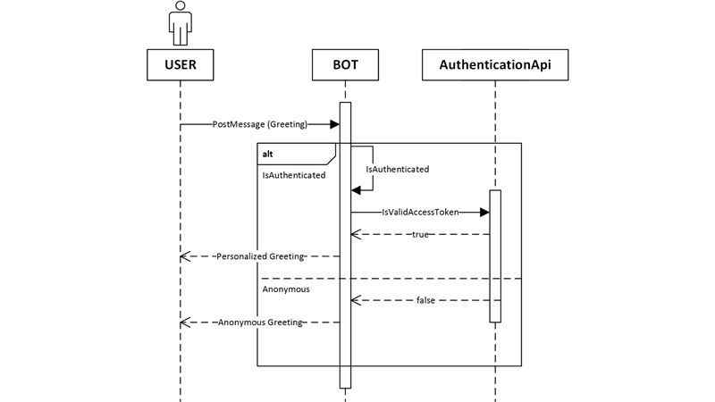
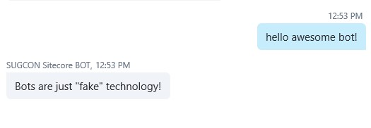
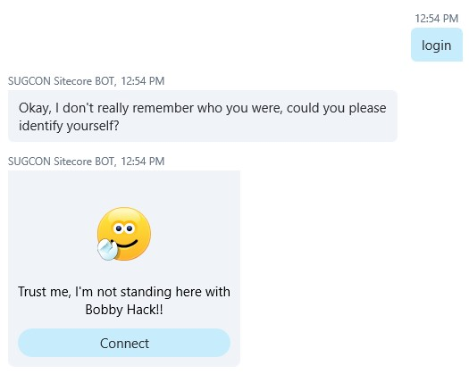
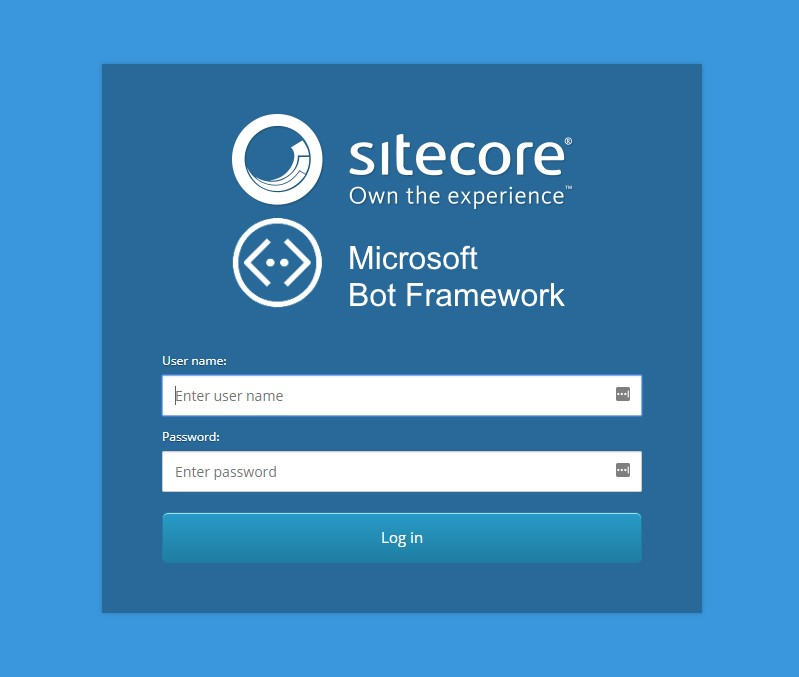
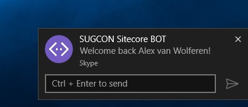
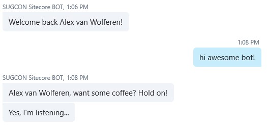
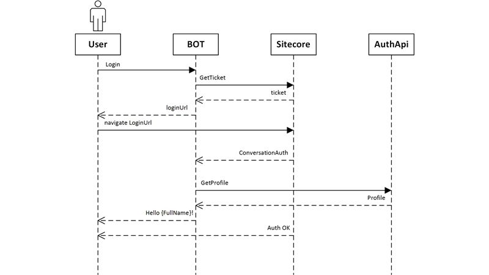

Expecting things to be secure isn't an option. Communication in a secure manner between the Microsoft Bot Framework and Sitecore.

## Secure communication between the Bot and custom API’s in Sitecore

For communication between the Bot and Sitecore I created several API’s that are hosted within Sitecore that use a token based authentication mechanism that I created myself. When the Bot needs to call an action on the API it provides a token with the call that is validated in the API. If the token is successfully validated the action continues, otherwise it results in a HTTP 401 response. I could have done this with an off-the-shelve authentication mechanism but I have chosen not to do that. You could use your own implementation and I suggest that if you are using my code as a basis you replace this mechanism with your own. When the user in the conversation isn’t authenticated the API uses a token that is only capable of validating user tokens with Sitecore. In case of an authenticated user in a conversation the token of the user will be used. That token is stored in a secure place. More about that in the next chapter.

## Authentication between the user in the conversation and Sitecore

For your understanding, it’s good to know that the Bot can distinguish you from others based on the UserID, BotID, ConversationID, ChannelID and ServiceURL.

The UserID in many channels is pretty much the same as your username. The BotID is the ID that you used when you registered your Bot with the Bot Directory. The ConversationID is the ID of the conversation. The ChannelID is based on the platform that you used for this conversation: Skype, Emulator, Facebook, Slack, WebChat and so on. The ServiceURL is used for identifying the specific Bot. You could be using the exact same deployment of your Bot on Azure for several customers. Just see this as a shop-in-shop webshop principle where you host one instance of your service and based on the context you know which webshop you need to query for product information. This all is used as the ConversationReference.

When you start a conversation with your Bot you are recognized by it. Everything your Bot needs to know from you is stored in the DialogContext, which eventually implements IBotData. IBotData contains the following properties:

ConversationData

Private Bot data associated with a conversation.

PrivateConversationData

Private Bot data associated with a user in a conversation.

UserData

Private bot data associated with a user (across all channels and conversations).

For authenticating the user in the conversation with Sitecore I used the PrivateConversationData to store information about the security context between the user and Sitecore. This PrivateConverstionData was ideal for this purpose. This means that once I authenticated a user with Sitecore it can only be used in the context of a single conversation from a specific user in this conversation because conversations can be held with more than two participants (the Bot and the actual user) and you don’t want others to use your Sitecore powers within that same conversation.

Authentication with the Bot happens when the user asks for something that needs the user to be authenticated with Sitecore. The following diagram shows the flow of the conversation when the user greets the bot in an authenticated situation and an anonymous situation.

When we’re working with Skype this looks like the following.

Next I ask the Bot if I could login. After this the Bot knows who I am and we can continue within an authenticated context. This also shows the entire flow of the authentication mechanism.

When I hit the “Connect” button I will be prompted with a web browser where I can enter my credentials.

After successful authentication, the webpage will tell me that I am logged in.

The Bot will also reply to me that I am authenticated and I can close the web browser because this login page is only intended to be used for Bot Authentication.

When I greet the bot in an authenticated context the bot will reply to me with a personalized message.

From now on I’m able to have the Bot communicate with my custom build API’s in Sitecore in my security context. Every operation I perform can be executed within in my own UserContext.

The actual authentication mechanism is drawn in the following diagram.

Because of the fact that the user needs to authenticate itself with Sitecore and both the Bot and Sitecore need to be on the same page about the specific user, there needs to be something like a ticket. The ticket is used by the Bot and Sitecore to know which user is trying to authenticate itself. This ticket is also used for holding information about the specific conversation and this information stays at the Sitecore side. Sitecore needs this information to make a call to an API on the side of the Bot to tell the Bot that the specific user in a specific conversation is successfully authenticated. This call from Sitecore to the Bot also holds a token that is placed in the PrivateConversationData for that specific user and conversation. It looks like a complex mechanism, but this was the only way I could be close to a 100 percent that no sensitive information is being carried between the Bot and the conversation that could be interpreted and abused.

If the PrivateConversationData is deleted the user will no longer be authenticated and cannot perform actions that needs the user to be authenticated, so it needs to authenticate itself again using the very same flow. From the perspective of the Bot you could implement a timeout mechanism. In my Bot I have implemented an expiration of one hour. I currently don’t validate this but you can add this to the validator.

## Read more!
